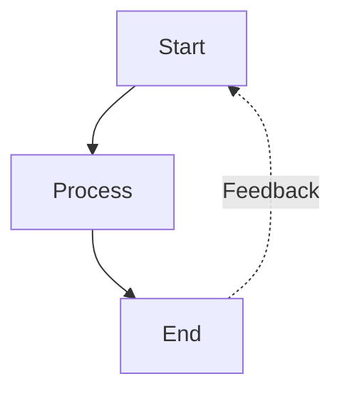
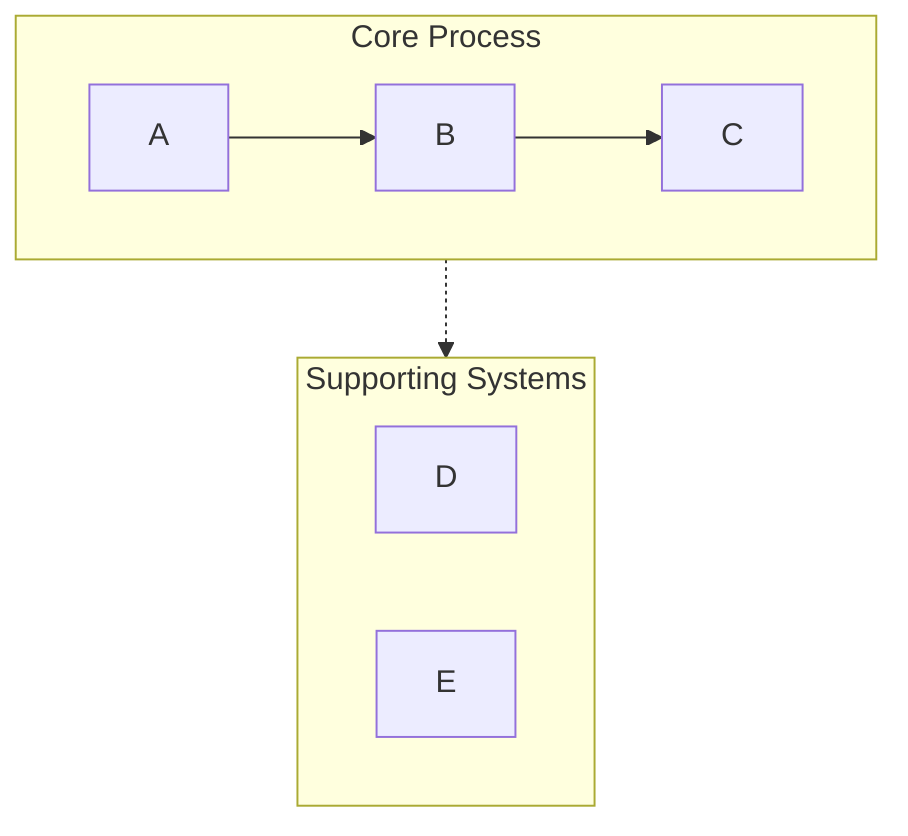

# Mermaid Syntax Rules Reference

## Critical Error Prevention

### List Syntax Conflict (Most Common Error)
The most common error in Mermaid occurs when node text contains a number followed by a period and a space (e.g., `[1. Process]`). Mermaid's parser incorrectly identifies this as a Markdown list item and fails to render.

**Corrective Actions:**
1. **Remove the space**: `[1.Process]`
2. **Use Circled Numbers**: `[① Process]` (Recommended for cleaner look)
3. **Use Parentheses**: `[(1) Process]`
4. **Use "Step" Prefix**: `[Step 1: Process]`

### Subgraph Naming Rules
Always use an ID and a display name in quotes to prevent spacing issues:
`subgraph core["Process Core"]`

### Node Reference Rules
When connecting to or from a subgraph, reference the subgraph's ID, not its display name.

## Node Syntax
- **Rectangle (Default)**: `[Text]`
- **Round Edges**: `(Text)`
- **Circle**: `((Text))`
- **Rhombus (Decision)**: `{Text}`
- **Database**: `[(Text)]`

## Arrow and Connection Types
- `-->` Solid arrow
- `-.->` Dashed arrow (for supporting systems, optional paths)
- `==>` Thick arrow (for emphasis)
- `~~~` Invisible link (for layout only)

## Common Patterns

### Feedback Loop

### Swimlane Pattern (Grouping)

---
