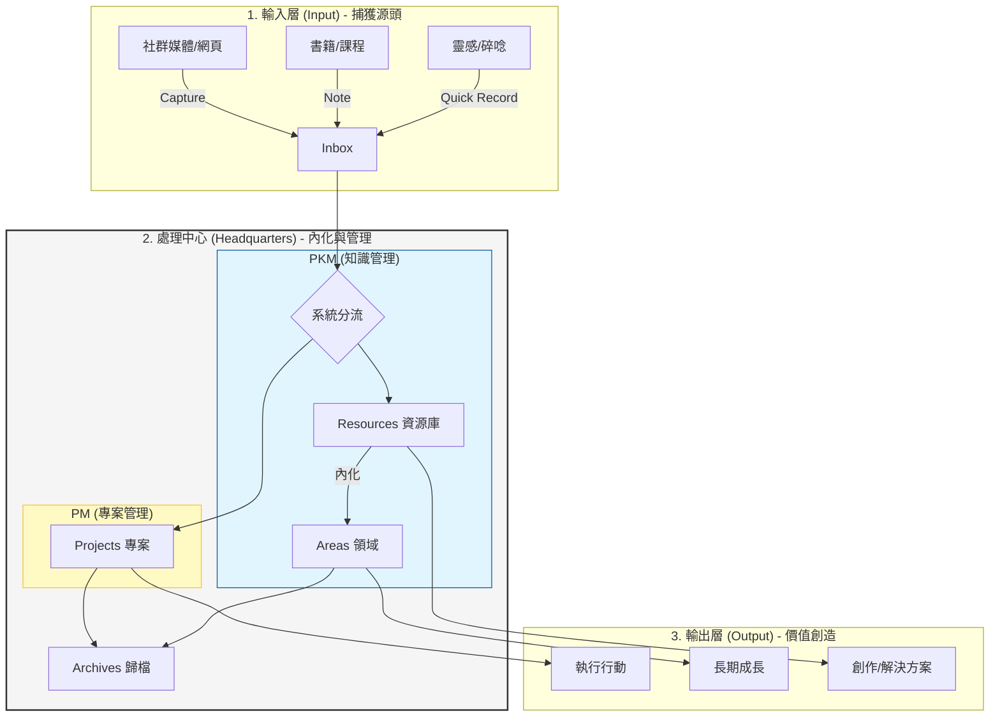

---
tags:
  - 系統化/指南
  - LifeOS
  - 數位收納
created: 2026-04-30
---

# 【實踐指南】人生系統化框架 (Life OS Implementation Guide)

這份指南旨在將「Life OS」從抽象的概念轉化為可執行的日常系統。透過系統化思維，我們能將混亂的資訊轉化為有價值的產出，並建立一個能持續自我進化的「第二大腦」。

---

## 一、 核心概念：Input-HQ-Output 模型

系統化人生的運作邏輯可以簡化為三個核心模組的循環：

### 1. 輸入層 (Input)：獲取資訊的源頭
*   **原則**：**快速捕獲，減少摩擦**。
*   **目標**：不讓大腦負擔「記憶」瑣碎資訊，而是讓工具負責「儲存」。
*   **常用工具**：
    *   手機備忘錄、錄音。
    *   瀏覽器插件 (Readwise, Web Clipper)。
    *   Obsidian 的 Inbox 資料夾。

### 2. 處理中心 (HQ)：雙軌制的內化過程
HQ 是整個系統的核心，分為 **PKM** 與 **PM** 兩個維度：

*   **PKM (Personal Knowledge Management)**：
    *   **核心**：知識的發散與收斂。
    *   **邏輯**：將外界資訊 (Resources) 轉化為個人領域 (Areas) 的智慧。
*   **PM (Project Management)**：
    *   **核心**：行動的跟蹤與執行。
    *   **邏輯**：確保專案 (Projects) 能夠在期限內達成產出。

### 3. 進化版 PARA 分類法
文章中強調，PARA 不只是資料夾，而是**資訊的流動狀態**：
*   **P (Projects)**：**「正在燃燒的事」**。有明確目標與截止日期（如：2 週內完成報告）。
*   **A (Areas)**：**「需要持續灌溉的地」**。長期責任，無截止日期但需持續投入（如：品牌經營、健康管理）。
*   **R (Resources)**：**「感興趣的圖書館」**。當前的興趣主題或未來可能用到的參考資料。
*   **Arch (Archives)**：**「完成或冷卻的紀錄」**。保持系統清爽的關鍵。

### 3. 輸出層 (Output)：創造價值的果實
*   **原則**：**以終為始，行動導向**。
*   **目標**：所有的輸入與處理，最終都必須導向某種形式的產出或自我提升。

---

## 二、 數位收納的四大層次

要建立真正的 Life OS，數位空間的收納需要遵循以下層次：

1.  **物理層面 (Storage)**：
    *   決定你的「檔案」放在哪裡（雲端、本地、Obsidian 庫）。
2.  **邏輯層面 (Logic)**：
    *   決定你的資料夾結構（如：PARA 或 MOC 系統）。
3.  **流程層面 (Workflow)**：
    *   決定資訊如何流動。例如：讀書筆記 -> 摘要 -> 內化為自己的卡片。
4.  **哲學層面 (Philosophy)**：
    *   明確「為什麼要做這件事」。系統是為了服務你的人生成長，而不是為了整理而整理。

---

## 三、 工具配置建議

根據文章建議，建議採用「多工具協作」來發揮各自優勢：

| 工具 | 角色 | 核心功能 |
| :--- | :--- | :--- |
| **Notion** | 行動中心 / 儀表板 | 任務追蹤、專案進度、結構化資料庫、公開分享。 |
| **Heptabase** | 思考中心 / 白板 | 視覺化思考、內化知識、建立概念間的連結、論文/報告撰寫。 |
| **Obsidian** | 知識庫 / 存檔中心 | 長期筆記存儲、雙向連結、個人日記、完全掌控的 Markdown 檔案。 |

---

## 四、 實踐步驟清單 (Action Plan)

### 第 1 步：建立基礎架構
- [ ] 在你的筆記軟體或硬碟中建立 `00_Inbox` 資料夾。
- [ ] 建立 `10_Projects`、`20_Areas`、`30_Resources`、`40_Archives` 四大資料夾。

### 第 2 步：定義捕獲流程
- [ ] 找到一個最適合你的「快速輸入」工具（如：手機上的簡單筆記軟體）。
- [ ] 設定每週日晚上為「Inbox 清空日」。

### 第 3 步：執行內化流程
- [ ] 當資訊進入 `30_Resources` 時，問自己：這跟我目前的哪個 `10_Projects` 或 `20_Areas` 相關？
- [ ] 嘗試用自己的話寫下這份資訊的摘要，而不只是剪藏。

### 第 4 步：定期系統維護
- [ ] **每日**：檢視 `10_Projects` 中的今日任務。
- [ ] **每週**：進行週回顧，調整專案進度。
- [ ] **每月/季**：將不再活躍的專案移至 `40_Archives`。

---

> [!TIP]
> **系統是活的。**
> 不要過度追求完美的分類，重要的是讓資訊能被你「重新利用」。如果一個系統讓你覺得維護起來很痛苦，那就簡化它。

---
**參考來源**：[[【我的人生系統 Life OS-01】用一張圖告訴你系統化人生的框架＃數位收納]]
