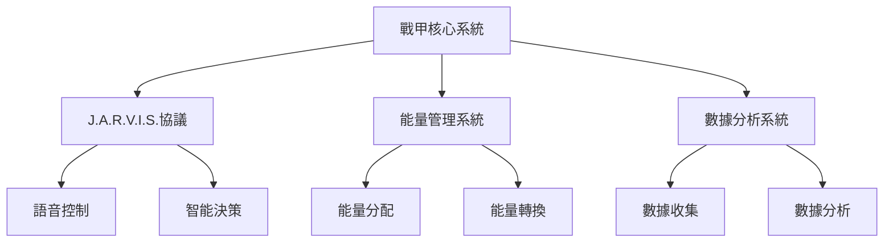

---
cssclasses:
  - editor-full
sticker: lucide//box-select
---

# 戰甲系統總覽

> [!quote] 戰甲啟動語音
> "歡迎回來，指揮官。戰甲系統已啟動，所有領域子系統正在初始化。準備好全方位提升人生了嗎？"

## 一、系統架構

### 1. 戰甲矩陣
| 領域 | 戰甲型號 | 核心能力 | 解鎖條件 | 特殊裝備 |
|------|----------|----------|----------|----------|
| 健康 | MARK-1 | 生物反饋系統 | 連續30天運動記錄 | 奈米醫療裝甲 |
| 家庭 | MARK-2 | 情感雷達系統 | 家庭信任值≥60% | 量子家庭協同裝甲 |
| 事業 | MARK-3 | 職業發展引擎 | 完成職業規劃 | 事業推進器 |
| 財務 | MARK-4 | 財富管理系統 | 建立預算系統 | 反浩克財務裝甲 |
| 社交 | MARK-5 | 人際網絡矩陣 | 建立核心社交圈 | 社交能量護盾 |
| 學習 | MARK-6 | 知識吸收引擎 | 完成學習計劃 | 思維加速器 |
| 休閒 | MARK-7 | 娛樂優化系統 | 建立興趣愛好 | 創意釋放裝甲 |
| 心靈 | MARK-8 | 精神淨化系統 | 建立冥想習慣 | 心靈防護罩 |

### 2. 核心系統架構


## 二、戰甲功能詳解

### 1. 領域戰甲規格

#### 1. 健康戰甲（MARK-1）
- **核心功能**：
  ```
  /JARVIS：「啟動健康監測協議：
  1. 生物數據實時監測（心率、血壓、睡眠質量）
  2. 運動計劃自動生成與調整
  3. 營養攝入優化建議
  4. 疲勞預警與恢復方案」
  ```
- **特殊裝備**：
  - 奈米醫療裝甲：自動修復與強化身體機能
  - 生物能量轉換器：將運動能量轉化為戰甲動力
  - 健康數據分析儀：預測健康風險並提供預防方案

#### 2. 家庭戰甲（MARK-2）
- **核心功能**：
  ```
  /JARVIS：「啟動家庭和諧協議：
  1. 家庭成員情緒監測與預警
  2. 家庭活動規劃與協調
  3. 親子互動質量評估
  4. 家庭財務健康監控」
  ```
- **特殊裝備**：
  - 量子家庭協同裝甲：增強家庭成員間的情感連接
  - 家庭記憶存儲器：記錄珍貴時刻並自動生成回憶錄
  - 家庭衝突調解器：提供客觀的解決方案建議

#### 3. 事業戰甲（MARK-3）
- **核心功能**：
  ```
  /JARVIS：「啟動職業發展協議：
  1. 職業技能評估與提升計劃
  2. 工作績效追蹤與優化
  3. 職業發展路徑規劃
  4. 工作生活平衡監控」
  ```
- **特殊裝備**：
  - 事業推進器：提供職業發展動力和方向
  - 技能加速器：快速掌握新技能和知識
  - 人脈擴展器：智能推薦職業發展機會

#### 4. 財務戰甲（MARK-4）
- **核心功能**：
  ```
  /JARVIS：「啟動財務管理協議：
  1. 收支追蹤與預算優化
  2. 投資組合分析與調整
  3. 債務管理與還款計劃
  4. 財務目標設定與追蹤」
  ```
- **特殊裝備**：
  - 反浩克財務裝甲：強大的債務消除能力
  - 財富增長加速器：優化投資回報
  - 風險預警系統：提前識別財務風險

#### 5. 社交戰甲（MARK-5）
- **核心功能**：
  ```
  /JARVIS：「啟動社交網絡協議：
  1. 社交圈質量評估
  2. 人際關係維護提醒
  3. 社交活動規劃
  4. 溝通技巧提升」
  ```
- **特殊裝備**：
  - 社交能量護盾：保護社交能量不被消耗
  - 人際關係分析儀：評估關係健康度
  - 社交技能提升器：提供溝通技巧訓練

#### 6. 學習戰甲（MARK-6）
- **核心功能**：
  ```
  /JARVIS：「啟動知識獲取協議：
  1. 學習計劃制定與調整
  2. 知識吸收效率優化
  3. 記憶強化與複習提醒
  4. 學習成果評估」
  ```
- **特殊裝備**：
  - 思維加速器：提升學習效率
  - 知識整合器：將新舊知識建立連接
  - 記憶強化器：優化長期記憶存儲

#### 7. 休閒戰甲（MARK-7）
- **核心功能**：
  ```
  /JARVIS：「啟動休閒優化協議：
  1. 興趣愛好發展規劃
  2. 休閒時間分配優化
  3. 娛樂活動質量提升
  4. 創意釋放引導」
  ```
- **特殊裝備**：
  - 創意釋放裝甲：激發創造力和想像力
  - 休閒活動優化器：提供個性化娛樂建議
  - 興趣培養加速器：快速發展新的興趣愛好

#### 8. 心靈戰甲（MARK-8）
- **核心功能**：
  ```
  /JARVIS：「啟動心靈淨化協議：
  1. 情緒狀態監測與調節
  2. 冥想與正念練習指導
  3. 壓力管理與釋放
  4. 人生意義探索」
  ```
- **特殊裝備**：
  - 心靈防護罩：抵禦負面情緒侵襲
  - 精神能量轉換器：將壓力轉化為動力
  - 心靈成長加速器：促進個人成長

### 2. 戰甲協同系統
```
/JARVIS：「啟動全領域協同模式：
1. 健康戰甲提供基礎能量支持
2. 心靈戰甲維持精神穩定
3. 事業戰甲推動職業發展
4. 財務戰甲確保資源充足
5. 家庭戰甲保持情感平衡
6. 社交戰甲擴展人脈網絡
7. 學習戰甲加速能力提升
8. 休閒戰甲釋放創意能量」
```

### 3. 能量管理系統
```dataviewjs
const 總能量 = 100;
const 各領域能量 = {
    健康: 20,
    心靈: 15,
    事業: 15,
    財務: 15,
    家庭: 10,
    社交: 10,
    學習: 10,
    休閒: 5
};

// 能量分配監控
function 檢查能量分配() {
    let 總分配 = 0;
    for (let 領域 in 各領域能量) {
        總分配 += 各領域能量[領域];
    }
    if (總分配 !== 總能量) {
        dv.span("⚠️警告：能量分配失衡，請重新調整")
    }
}
```

## 三、進化與獎勵系統

### 1. 戰甲進化路徑

#### 單領域專精
```
/JARVIS：「啟動專精進化協議：
1. 選擇一個領域進行深度開發
2. 完成該領域的所有進階任務
3. 解鎖該領域的終極戰甲形態
4. 獲得領域大師稱號」
```

#### 多領域平衡
```
/JARVIS：「啟動平衡進化協議：
1. 同時提升多個領域的發展
2. 維持領域間的協同效應
3. 解鎖跨領域特殊能力
4. 獲得生命之輪守護者稱號」
```

### 2. 成就系統
```dataviewjs
const 成就徽章 = {
    健康大師: "完成所有健康相關任務",
    家庭守護者: "維持家庭和諧指數90%以上",
    事業領航者: "達成職業發展里程碑",
    財務智者: "實現財務自由目標",
    社交達人: "建立高質量社交圈",
    學習先驅: "掌握多個領域知識",
    休閒藝術家: "培養多樣化興趣愛好",
    心靈導師: "達到心靈平衡狀態"
};

// 顯示已解鎖的成就
function 顯示成就() {
    for (let 徽章 in 成就徽章) {
        dv.span(`🏆 ${徽章}: ${成就徽章[徽章]}`);
    }
}
```

### 3. 升級系統

#### 特殊能力解鎖
```
/JARVIS：「啟動能力解鎖協議：
1. 領域專精能力：
   - 健康戰甲：生命能量爆發
   - 家庭戰甲：情感共鳴增幅
   - 事業戰甲：職業技能加速
   - 財務戰甲：財富增長爆發
   - 社交戰甲：人際關係強化
   - 學習戰甲：知識吸收加速
   - 休閒戰甲：創意能量爆發
   - 心靈戰甲：精神力量增幅

2. 跨領域協同能力：
   - 健康+心靈：身心平衡增幅
   - 事業+財務：財富創造加速
   - 家庭+社交：人際和諧提升
   - 學習+休閒：創意學習模式」
```

#### 戰甲升級材料
```dataviewjs
const 升級材料 = {
    健康結晶: "完成健康任務獲得",
    家庭寶石: "完成家庭任務獲得",
    事業徽章: "完成事業任務獲得",
    財務金幣: "完成財務任務獲得",
    社交能量: "完成社交任務獲得",
    學習碎片: "完成學習任務獲得",
    休閒精華: "完成休閒任務獲得",
    心靈光輝: "完成心靈任務獲得"
};

// 顯示升級材料收集進度
function 顯示材料進度() {
    for (let 材料 in 升級材料) {
        dv.span(`💎 ${材料}: ${升級材料[材料]}`);
    }
}
```

## 四、使用指南

### 1. 基礎操作
```
/JARVIS：「啟動新手引導協議：
1. 戰甲啟動：
   - 使用 /JARVIS 命令喚醒系統
   - 選擇要啟動的戰甲類型
   - 確認能量水平充足

2. 戰甲切換：
   - 使用 /切換戰甲 命令
   - 選擇目標戰甲
   - 等待切換完成

3. 能量管理：
   - 監控能量水平
   - 及時補充能量
   - 避免能量過載」
```

### 2. 進階技巧
```
/JARVIS：「啟動進階操作協議：
1. 戰甲組合：
   - 選擇互補的戰甲組合
   - 啟動協同作戰模式
   - 發揮組合優勢

2. 能量優化：
   - 合理分配能量
   - 使用能量轉換器
   - 儲存備用能量

3. 特殊能力：
   - 解鎖並熟練使用特殊能力
   - 掌握能力冷卻時間
   - 優化能力使用時機」
```

### 3. 常見問題

#### 基礎問題
1. **Q: 如何選擇適合的戰甲？**
   ```
   /JARVIS：「啟動戰甲選擇協議：
   1. 評估當前需求
   2. 分析個人特點
   3. 考慮發展方向
   4. 選擇最優戰甲」
   ```

2. **Q: 戰甲能量不足怎麼辦？**
   ```
   /JARVIS：「啟動能量補充協議：
   1. 識別能量消耗原因
   2. 啟動能量轉換器
   3. 使用能量補充劑
   4. 優化能量使用」
   ```

3. **Q: 如何提升戰甲等級？**
   ```
   /JARVIS：「啟動等級提升協議：
   1. 完成日常任務
   2. 收集升級材料
   3. 進行戰甲訓練
   4. 參與特殊挑戰」
   ```

#### 進階問題
1. **Q: 如何實現多戰甲協同？**
   ```
   /JARVIS：「啟動協同優化協議：
   1. 選擇互補戰甲
   2. 建立能量連接
   3. 啟動協同模式
   4. 優化作戰效果」
   ```

2. **Q: 戰甲出現故障怎麼辦？**
   ```
   /JARVIS：「啟動故障排除協議：
   1. 診斷故障原因
   2. 啟動備用系統
   3. 執行修復程序
   4. 預防再次發生」
   ```

3. **Q: 如何解鎖特殊能力？**
   ```
   /JARVIS：「啟動能力解鎖協議：
   1. 完成特定任務
   2. 收集解鎖材料
   3. 進行能力訓練
   4. 通過能力測試」
   ```

## 五、系統維護

### 1. 日常維護
```
/JARVIS：「啟動日常維護協議：
1. 檢查各領域能量水平
2. 進行必要的能量補充
3. 優化戰甲性能
4. 更新作戰數據」
```

### 2. 週期性升級
```
/JARVIS：「啟動週期升級協議：
1. 評估戰甲整體性能
2. 識別需要改進的領域
3. 制定升級計劃
4. 執行升級程序」
```

### 3. 緊急修復
```
/JARVIS：「啟動緊急修復協議：
1. 識別受損領域
2. 啟動應急能量儲備
3. 執行快速修復
4. 恢復正常運作」
```

## 六、發展規劃

### 1. 更新日誌
```
/JARVIS：「啟動更新日誌協議：
1. 核心功能：
   - 實現基礎戰甲系統
   - 添加能量管理功能
   - 建立戰甲切換機制

2. 領域戰甲：
   - 解鎖8個基礎領域戰甲
   - 實現戰甲協同功能
   - 添加特殊能力系統

3. 系統優化：
   - 優化能量使用效率
   - 改進戰甲切換速度
   - 提升系統穩定性」
```

### 2. 未來規劃

#### 短期目標
```dataviewjs
const 短期目標 = {
    系統優化: "提升戰甲性能和穩定性",
    功能擴展: "添加新的戰甲類型和能力",
    用戶體驗: "改進操作界面和使用流程",
    數據分析: "實現更智能的決策支持"
};

// 顯示短期目標進度
function 顯示短期目標() {
    for (let 目標 in 短期目標) {
        dv.span(`🎯 ${目標}: ${短期目標[目標]}`);
    }
}
```

#### 中期規劃
```
/JARVIS：「啟動中期規劃協議：
1. 技術升級：
   - 引入量子計算技術
   - 實現神經網絡優化
   - 開發生物智能接口

2. 功能擴展：
   - 添加跨平台支持
   - 實現雲端同步
   - 開發社區功能

3. 生態建設：
   - 建立開發者平台
   - 鼓勵插件開發
   - 形成用戶社區」
```

#### 長期願景
```
/JARVIS：「啟動願景規劃協議：
1. 技術突破：
   - 實現全息投影界面
   - 開發腦機交互技術
   - 建立量子通訊網絡

2. 功能創新：
   - 實現戰甲自主進化
   - 開發群體協同系統
   - 建立智能生態圈

3. 社會影響：
   - 推動技術普及
   - 促進社會進步
   - 創造美好未來」
```

### 3. 社區參與

#### 開發者計劃
```
/JARVIS：「啟動開發者計劃協議：
1. 開發者權益：
   - 提供API接口
   - 開放插件系統
   - 建立收益分成

2. 技術支持：
   - 提供開發文檔
   - 建立技術社區
   - 舉辦開發者大會

3. 激勵機制：
   - 設立創新獎勵
   - 提供資源支持
   - 建立榮譽體系」
```

#### 用戶參與
```
/JARVIS：「啟動用戶參與協議：
1. 反饋機制：
   - 建立問題反饋系統
   - 收集功能建議
   - 進行用戶調研

2. 社區活動：
   - 舉辦線上活動
   - 組織線下聚會
   - 開展用戶培訓

3. 獎勵計劃：
   - 設立貢獻獎勵
   - 提供專屬權益
   - 建立等級體系」
```

## 七、法律與倫理

### 1. 使用規範
```
/JARVIS：「啟動使用規範協議：
1. 基本原則：
   - 遵守相關法規
   - 尊重個人隱私
   - 維護社會秩序

2. 數據安全：
   - 加密存儲數據
   - 保護用戶隱私
   - 防止數據洩露

3. 倫理準則：
   - 促進社會進步
   - 維護公平正義
   - 承擔社會責任」
```

### 2. 免責聲明
```
/JARVIS：「啟動免責聲明協議：
1. 使用風險：
   - 個人承擔使用風險
   - 遵守安全使用規範
   - 注意個人安全

2. 責任限制：
   - 系統僅提供輔助功能
   - 不承擔直接責任
   - 保留解釋權

3. 協議變更：
   - 保留更新權利
   - 提前通知變更
   - 用戶可選擇接受或退出」
```

> [!tip] 戰甲啟動儀式
> 每日早晨，啟動戰甲系統前，進行3分鐘的專注呼吸，設定當日意圖，然後說出啟動語音："J.A.R.V.I.S.，啟動戰甲系統，今日我們將改變世界。"
