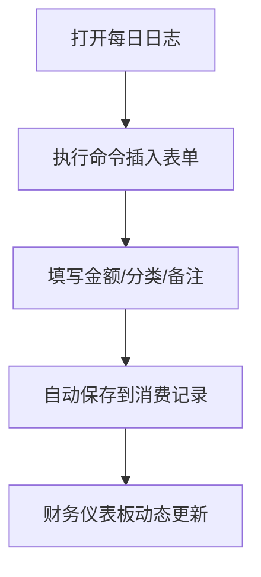

---
tags: [系統/專案]
status: doing
time_create: 2026-02-27
time_modifie: 2026-02-27
related:
parent:
---

基于你的需求（快速添加消费记录 + 动态仪表板展示），推荐使用 **执行命令** 作为主要操作方式，结合 **Components 插件** 和 **Dataview 插件** 实现无缝记账流程。以下是具体分析和完整构建方案：

---

### **一、执行命令 vs 运行脚本的对比**
| **方式**      | **优点**                               | **缺点**                               | **适用场景**               |
|---------------|---------------------------------------|---------------------------------------|---------------------------|
| **执行命令**   | 操作快，无需编码，一键插入预设表单       | 灵活性较低，依赖预配置模板             | 快速输入标准化记账条目       |
| **运行脚本**   | 高度定制化，可动态处理复杂逻辑           | 需写代码，学习成本高，调试耗时         | 需要动态计算或跨插件交互的场景 |

**结论**：  
使用 **Components 插件创建预设命令** 快速插入记账表单，搭配 **Dataview 自动聚合数据**，是最简单高效的方案。

---

### **二、完整构建步骤**

#### **1. 准备工作**
- **安装插件**：
  - [Components](https://github.com/VKxMM/Components)：用于快速插入预设表单。
  - [Dataview](https://github.com/blacksmithgu/obsidian-dataview)：动态生成财务仪表板。
  - [Templater](https://github.com/SilentVoid13/Templater)（可选）：自动化日期和交互输入。

- **文件结构**：
  ```
  MyVault/
  ├─ 00-记账系统/
  │  ├─ 消费记录/          # 存放每日消费条目
  │  ├─ 财务仪表板.md      # 动态展示收支数据
  │  └─ templates/
  │     └─ 消费表单.md     # Components 模板
  ```

---

#### **2. 创建消费记录表单模板**
在 `00-记账系统/templates/消费表单.md` 中定义记账模板：  
````markdown
### 消费记录
**类型**:: 支出  
**分类**:: <% await tp.system.suggester(["餐饮", "交通", "娱乐", "购物"], ["餐饮", "交通", "娱乐", "购物"]) %>  
**金额**:: ¥<% await tp.system.prompt("金额") %>  
**时间**:: <% tp.date.now("HH:mm") %>  
**备注**:: <% await tp.system.prompt("备注（可选）") %>  
````

---

#### **3. 配置 Components 插件**
1. **注册组件**：
   - 打开 Components 插件设置 → 添加新组件。
   - **名称**：`快速记账`  
   - **模板路径**：`00-记账系统/templates/消费表单.md`

2. **绑定快捷键**（可选）：
   - 在 Obsidian 快捷键设置中，为 `Components: Insert 快速记账` 设置快捷键（如 `Ctrl+Shift+C`）。

---

#### **4. 插入消费记录到每日日志**
- **操作流程**：
  1. 打开或新建每日日志（如 `2023-10-10.md`）。
  2. 执行命令 `Components: Insert 快速记账`（或使用快捷键）。
  3. 根据提示填写金额、分类、备注，自动生成如下内容：
     ```markdown
     ### 消费记录
     **类型**:: 支出  
     **分类**:: 餐饮  
     **金额**:: ¥35  
     **时间**:: 12:30  
     **备注**:: 午餐快餐  
     ```

---

#### **5. 构建财务仪表板**
在 `00-记账系统/财务仪表板.md` 中，使用 Dataview 动态统计所有消费记录：  
````markdown
## 财务概览

### 本月收支统计
```dataview
TABLE WITHOUT ID
  分类 AS 类别,
  sum(金额) AS 总金额
FROM "00-记账系统/消费记录"
WHERE 类型 = "支出" AND dateformat(file.ctime, "yyyy-MM") = dateformat(this.file.ctime, "yyyy-MM")
GROUP BY 分类
```

### 历史消费趋势
```dataview
CALENDAR file.ctime
FROM "00-记账系统/消费记录"
WHERE 类型 = "支出"
```

### 总览
```dataview
LIST
FROM "00-记账系统/消费记录"
WHERE 类型 = "支出"
SORT file.ctime DESC
LIMIT 10
```
````

---

#### **6. 自动化增强（可选）**
若需更高自动化，可结合 **Templater**：  
1. 在每日日志模板中自动插入记账区块：
   ```markdown
   ## 今日消费
   <%* await tp.user.components("快速记账") %>
   ```
2. 在记账后自动更新总览：  
   在 `消费表单.md` 末尾添加 DataviewJS 代码，实时刷新仪表板：
   ```dataviewjs
   dv.span("**[更新仪表板](#财务仪表板)**");
   ```

---

### **三、操作流程图**


---

### **四、优势总结**
1. **极速操作**：一键插入表单，5秒完成记账。
2. **零编码**：无需编写脚本，适合非技术用户。
3. **动态聚合**：仪表板实时反映最新数据。
4. **灵活扩展**：可随时修改模板字段或统计逻辑。

通过此方案，你可以在 Obsidian 中实现媲美专业记账软件的效率，同时保持数据的完全掌控。
