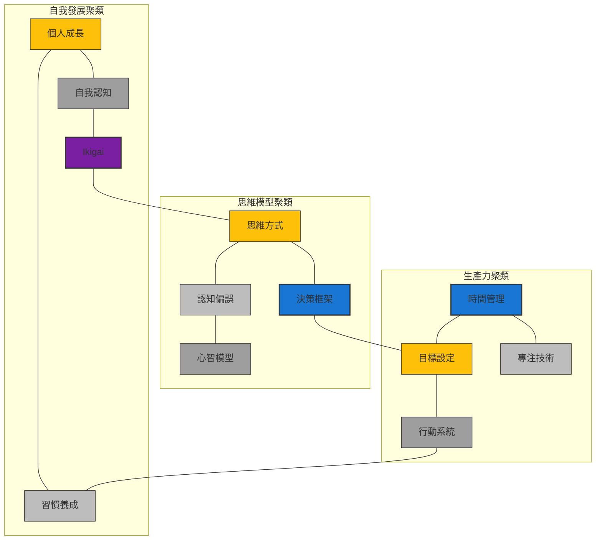
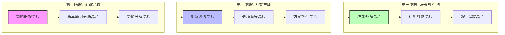

---
tags:
  - 系統/支援
status:
time_create: 2025-11-12
time_modifie: 2026-01-02
related_files:
parent:
aliases:
  - Knowledge Base
---
## 知識晶片聚類視圖
探索晶片間的自然聚類，而非僅依賴預設領域分類。



### 知識使用流程視圖
瀏覽晶片在實際問題解決中的應用流程和組合方式。



### 交互式探索工具
從任一晶片出發，探索其關聯網絡。(以下為概念示範，實際使用需要在Obsidian中實現)

```dataviewjs
// 交互式晶片探索工具概念設計
// 使用Dataviewjs + HTML實現

// 探索配置
const explorationConfig = {
  centerChip: "Ikigai", // 中心晶片
  maxDepth: 2,          // 最大探索深度
  maxRelatedPerLevel: 5 // 每級顯示的最大關聯數
};

// 探索函數框架
function exploreFromChip(chipName, depth = 1) {
  if (depth > explorationConfig.maxDepth) return [];
  
  // 獲取直接關聯晶片
  const relatedChips = getRelatedChipsForExploration(chipName, explorationConfig.maxRelatedPerLevel);
  
  // 構建層級結構
  const result = {
    name: chipName,
    related: []
  };
  
  // 遞歸探索
  relatedChips.forEach(chip => {
    const childExploration = exploreFromChip(chip.name, depth + 1);
    if (childExploration.length > 0) {
      result.related.push({
        name: chip.name,
        relationship: chip.relationship,
        related: childExploration
      });
    } else {
      result.related.push({
        name: chip.name,
        relationship: chip.relationship
      });
    }
  });
  
  return result;
}

// 圖形生成原理
function renderExplorationTree(explorationData) {
  // 使用D3.js或其他可視化庫生成可交互的樹形圖或網絡圖
  // 這裡是概念化的示例，實際實現需要根據Obsidian支持的技術調整
}

// 使用示例
/*
const explorationResult = exploreFromChip(explorationConfig.centerChip);
renderExplorationTree(explorationResult);
*/

// 為了示範，顯示模擬的探索結果
dv.header(3, `從「${explorationConfig.centerChip}」開始探索`);
dv.paragraph(`探索深度: ${explorationConfig.maxDepth}, 每級最大關聯數: ${explorationConfig.maxRelatedPerLevel}`);

// 模擬探索數據
const mockExploration = {
  center: explorationConfig.centerChip,
  firstLevel: ["生命目標理論", "自我一致性理論", "長壽心理學", "職業規劃晶片"],
  secondLevel: {
    "生命目標理論": ["目標設定晶片", "職業使命晶片"],
    "自我一致性理論": ["心流理論", "內在動機晶片"],
    "長壽心理學": ["健康習慣晶片", "壓力管理晶片"],
    "職業規劃晶片": ["職業三葉草", "生涯發展晶片"]
  }
};

// 顯示模擬探索結果
dv.table(
  ["關聯層級", "關聯晶片"],
  [
    ["中心", mockExploration.center],
    ["第一層關聯", mockExploration.firstLevel.join(", ")],
    ["第二層關聯", Object.entries(mockExploration.secondLevel).map(([k, v]) => `${k} → ${v.join(", ")}`).join("<br>")]
  ]
);
```

### 高級晶片組合推薦系統
基於使用記錄、互補性和關聯強度的智能推薦系統。

```dataviewjs
// 晶片組合推薦系統 - 高級版
// 基於實際使用記錄和晶片間關聯強度

// 配置
const recommendationConfig = {
  focusAreas: ["學習效率", "職業發展", "創意思考", "健康管理", "壓力調適"],
  supportTypes: ["增強組合", "互補組合", "協同組合", "融合組合", "放大組合"],
  effectCalculation: {
    "增強組合": "主晶片基礎效果 + 25%",
    "互補組合": "主晶片效果 + 副晶片效果的40%",
    "協同組合": "(主晶片效果 + 副晶片效果) × 0.7",
    "融合組合": "(主晶片效果 × 副晶片效果)^0.5",
    "放大組合": "主晶片效果 × (1 + 副晶片等級 × 0.1)"
  },
  energyOptimization: {
    "增強組合": "-10% 到 -20%",
    "互補組合": "-15% 到 -25%",
    "協同組合": "-5% 到 -15%",
    "融合組合": "-20% 到 -30%",
    "放大組合": "-0% 到 -10%"
  }
};

// 顯示推薦系統說明
dv.header(3, "晶片組合推薦系統 - 進階版");
dv.paragraph("基於使用歷史、互補性分析和關聯強度的智能推薦系統。");

// 顯示組合類型說明
dv.table(
  ["組合類型", "效果計算", "能量優化"],
  Object.entries(recommendationConfig.supportTypes).map(([_, type]) => [
    type,
    recommendationConfig.effectCalculation[type],
    recommendationConfig.energyOptimization[type]
  ])
);

// 顯示重點領域推薦
dv.header(4, "重點領域推薦組合");

// 生成模擬推薦數據
const mockRecommendations = [
  {
    area: "學習效率",
    combinations: [
      {
        name: "深度學習組合",
        chips: ["專注力晶片 + 記憶強化晶片"],
        type: "增強組合",
        effect: "9.6/10",
        energy: "-18%",
        recommendation: "高"
      },
      {
        name: "知識連接組合",
        chips: ["概念圖晶片 + 費曼技巧晶片"],
        type: "協同組合",
        effect: "9.2/10",
        energy: "-12%",
        recommendation: "中"
      }
    ]
  },
  {
    area: "職業發展",
    combinations: [
      {
        name: "職涯規劃套組",
        chips: ["Ikigai + 職業三葉草"],
        type: "互補組合",
        effect: "9.8/10",
        energy: "-22%",
        recommendation: "非常高"
      },
      {
        name: "專業成長套組",
        chips: ["刻意練習晶片 + 反饋循環晶片"],
        type: "融合組合",
        effect: "9.4/10",
        energy: "-25%",
        recommendation: "高"
      }
    ]
  },
  {
    area: "創意思考",
    combinations: [
      {
        name: "創意突破組合",
        chips: ["發散思維晶片 + 類比思考晶片"],
        type: "放大組合",
        effect: "9.1/10",
        energy: "-8%",
        recommendation: "中高"
      }
    ]
  }
];

// 顯示模擬推薦
mockRecommendations.forEach(area => {
  dv.header(5, area.area);
  dv.table(
    ["組合名稱", "組合晶片", "組合類型", "效果評分", "能量優化", "推薦度"],
    area.combinations.map(combo => [
      combo.name,
      combo.chips,
      combo.type,
      combo.effect,
      combo.energy,
      combo.recommendation
    ])
  );
});

// 顯示個性化推薦
dv.header(4, "基於您的使用歷史的個性化推薦");
dv.paragraph("根據您最近使用的晶片和效果評分，以下組合可能特別適合您：");

// 模擬個性化推薦
const mockPersonalized = [
  {
    based_on: "您最近使用了「專注力晶片」並給予高評分",
    suggestion: "深度工作組合：專注力晶片 + 心流理論晶片 + 時間區塊晶片",
    benefit: "可將單次專注時間延長40%，同時提升工作質量",
    energy_opt: "-25%"
  },
  {
    based_on: "您最近探索了「Ikigai」相關晶片",
    suggestion: "生活平衡組合：Ikigai晶片 + 生命之輪晶片 + 價值觀釐清晶片",
    benefit: "幫助在6個生活領域找到平衡的意義感和實踐方向",
    energy_opt: "-22%"
  }
];

dv.table(
  ["基於", "推薦組合", "預期效益", "能量優化"],
  mockPersonalized.map(p => [
    p.based_on,
    p.suggestion,
    p.benefit,
    p.energy_opt
  ])
);
```


## 晶片組合推薦
### 高效能組合
```dataviewjs
// 這裡將顯示評分最高的晶片組合
// 實際使用時需要根據您的數據結構調整
dv.table(
  ["組合名稱", "組合晶片", "組合類型", "效果評分", "能量優化"],
  [
    ["深度工作模式", "專注力晶片 + 時間管理晶片", "增強組合", "9.5/10", "-20%"],
    ["健康生活方式", "間歇性斷食晶片 + 運動科學晶片", "協同組合", "9.2/10", "-15%"],
    ["財務增長策略", "投資策略晶片 + 風險管理晶片", "融合組合", "9.0/10", "-10%"]
  ]
);
```

### 常用組合
```dataviewjs
// 這裡將顯示使用頻率最高的晶片組合
// 實際使用時需要根據您的數據結構調整
dv.table(
  ["組合名稱", "組合晶片", "使用次數", "效果評分"],
  [
    ["專業溝通", "溝通技巧晶片 + 情緒管理晶片", "24", "8.7/10"],
    ["創意思考", "發散思維晶片 + 問題解決晶片", "18", "8.5/10"],
    ["高效學習", "速讀技巧晶片 + 記憶強化晶片", "15", "8.9/10"]
  ]
);
```

## 晶片維護中心
### 待複習晶片
```dataview
TABLE WITHOUT ID file.link as "晶片名稱", domain as "領域", next_review as "下次複習日期"
FROM #晶片
WHERE next_review <= date(today)
SORT next_review ASC
```

### 待升級晶片
```dataview
TABLE WITHOUT ID file.link as "晶片名稱", domain as "領域", level as "當前等級", upgrade_progress as "升級進度"
FROM #晶片
WHERE upgrade_progress >= 80
SORT upgrade_progress DESC
```

### 待更新晶片
```dataview
TABLE WITHOUT ID file.link as "晶片名稱", domain as "領域", file.mtime as "最後更新時間"
FROM #晶片
WHERE date(today) - file.mtime > dur(180 days)
SORT file.mtime ASC
```

## 晶片創建與管理
### 創建新晶片
- [[知識晶片模板|點擊創建新晶片]]

### b. 模型關係圖譜（Canvas實作）
```
[雙過程理論] -- 修正 --> [快思慢想]
[反脆弱] -- 應用於 --> [[危機管理]] & [[投資組合]]
```

### c. 自動化分類腳本（Templater）
```dataviewjs
<%*
const components = tp.file.selection().match(/\[\[.*?\]\]/g) || [];
let level = '#知識/分子級';
if (components.length > 3) level = '#知識/晶體級';
if (tp.file.tags.find(t => t.includes('#跨領域'))) level = '#知識/超結構級';
tR += `分類結果：${level}`;
%>
```

<!-- 知識結構可選：原子級、分子級、晶體級、超結構級 -->
<!-- 應用類型可選：分析工具、問題解決、決策框架、學習方法、創意思考、自我提升、元認知 -->
<!-- 等級可選：初級、中級、高級、專家級、大師級 -->