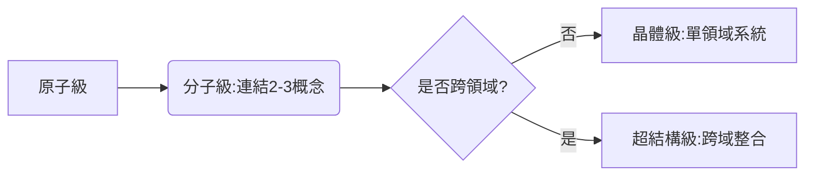
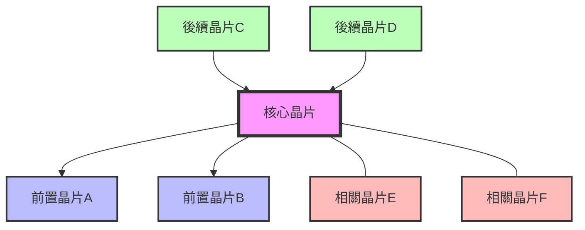
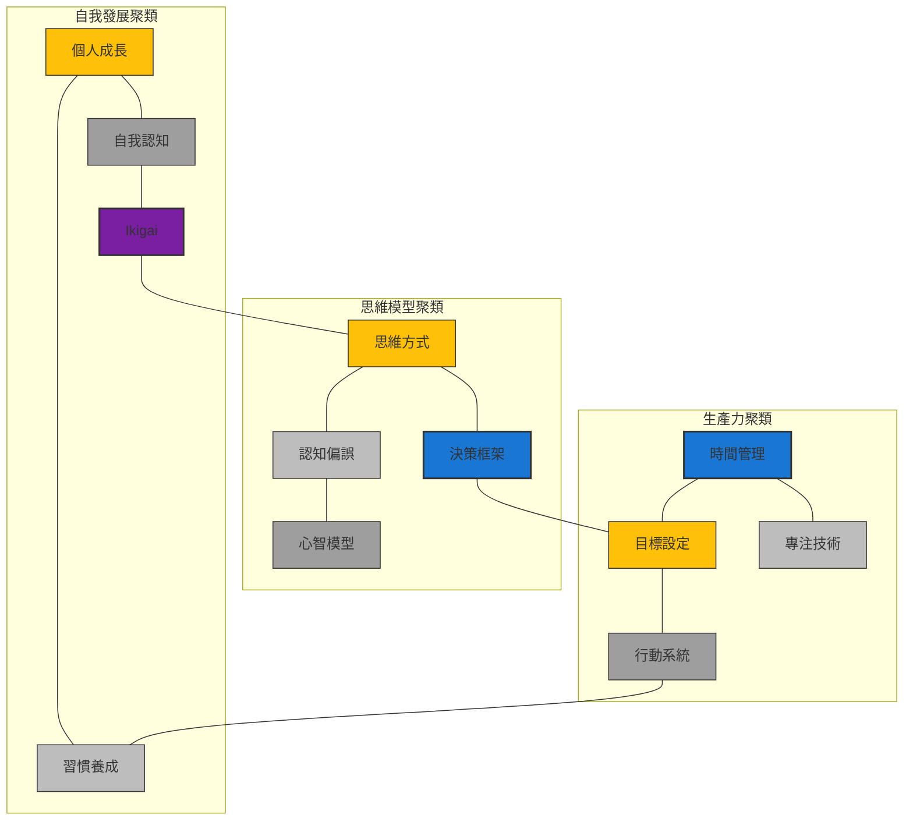
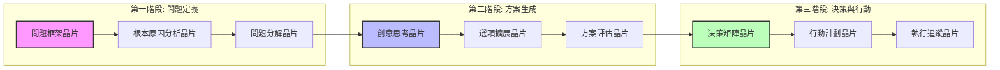

---
cssclasses:
  - editor-full
  - knowledge-database
  - dashboard
aliases:
  - 量子知識庫
  - 晶片矩陣
  - Quantum Knowledge Base
  - Chip Matrix
---
# 量子知識庫 - 晶片矩陣

## 1. 分類依據：知識結構的複雜性與應用層次
根據動態標籤系統的四級分類框架：
- **原子級（孤立事實）**：單一數據點或基礎概念（如「重力加速度=9.8 m/s²」）
- **分子級（概念關係）**：兩個以上概念的連結（如「供需曲線交互作用」）
- **晶體級（理論框架）**：系統化的解釋模型（如「馬斯洛需求層次理論」）
- **超結構級（跨域模型）**：整合多領域的決策工具（如「第一性原理」）

## 2. 思維模型的具體分級
| 模型類型          | 標籤層級      | 分類邏輯                                                                 | Obsidian標註範例                     |
|-------------------|---------------|--------------------------------------------------------------------------|--------------------------------------|
| **基礎分析模型**  | 分子級        | 連結有限概念（如「SWOT分析」連結優勢/劣勢/機會/威脅）                    | `#知識/分子級` `#分析工具/SWOT`      |
| **學科理論模型**  | 晶體級        | 系統化解釋現象（如「雙過程理論」解釋直覺與理性決策）                     | `#知識/晶體級` `#認知科學/雙過程`    |
| **跨域決策模型**  | 超結構級      | 整合多領域邏輯（如「反脆弱性」結合風險管理、生物學、經濟學）             | `#知識/超結構級` `#決策/反脆弱`      |
| **元認知模型**    | 超結構級      | 指導其他模型的模型（如「批判性思維框架」審視知識建構本身）               | `#知識/超結構級` `#元認知/批判框架`  |

## 3. 進階分類準則
### a. 模型演化路徑


### b. 功能密度指標
- **單一功能模型**（如「SMART目標原則」）→ 分子級
- **多層次功能模型**（如「OKR目標管理系統」）→ 晶體級
- **生態級功能模型**（如「複雜適應系統理論」）→ 超結構級

## 晶片統計儀表板
### 等級分布
```dataviewjs
const levels = {
  "1": 0,
  "2": 0,
  "3": 0,
  "4": 0,
  "5": 0
};

// 計算各等級晶片數量
dv.pages('#晶片').forEach(page => {
  const level = page.file.frontmatter.level;
  if (level && levels[level] !== undefined) {
    levels[level]++;
  }
});

// 顯示統計結果
dv.table(["等級", "晶片數量"],
  Object.entries(levels)
    .filter(([_, count]) => count > 0)
    .map(([level, count]) => ["Level " + level, count])
);
```

### 最近更新
```dataview
TABLE WITHOUT ID file.link as "晶片名稱", level as "等級", file.mtime as "更新時間"
FROM #晶片
SORT file.mtime DESC
LIMIT 10
```

### 使用頻率
```dataview
TABLE WITHOUT ID file.link as "晶片名稱", level as "等級", usage_count as "使用次數"
FROM #晶片
SORT usage_count DESC
LIMIT 10
```

## 晶片視覺化中心
### 知識結構矩陣視圖
```dataviewjs
// 創建知識結構矩陣視圖 - 基於動態標籤系統
const knowledgeLevels = ["原子級", "分子級", "晶體級", "超結構級"];
const applicationAreas = ["分析工具", "問題解決", "決策框架", "學習方法", "創意思考", "自我提升", "元認知"];

// 顏色配置
const structureLevelColors = {
  "原子級": "#BDBDBD", // 淺灰
  "分子級": "#9E9E9E", // 銀色
  "晶體級": "#FFC107", // 金色
  "超結構級": "#7B1FA2" // 紫晶
};

const applicationColors = {
  "分析工具": "#4CAF50", // 綠色
  "問題解決": "#2196F3", // 藍色
  "決策框架": "#FF9800", // 橙色
  "學習方法": "#F44336", // 紅色
  "創意思考": "#9C27B0", // 紫色
  "自我提升": "#00BCD4", // 青色
  "元認知": "#673AB7"   // 深紫
};

// 創建矩陣表格
let tableRows = [];

// 表頭
let headerRow = ["知識結構"];
applicationAreas.forEach(area => {
  headerRow.push(area);
});
tableRows.push(headerRow);

// 表格內容
knowledgeLevels.forEach(level => {
  let row = [level];
  
  applicationAreas.forEach(area => {
    // 使用顏色表示不同應用領域
    const structureColor = structureLevelColors[level];
    const appColor = applicationColors[area];
    const style = `background-color: ${structureColor}30; color: ${appColor}; border-radius: 4px; padding: 2px 6px; border: 1px solid ${appColor}50;`;
    
    // 獲取該知識結構和應用領域的晶片數量
    // 注意：這裡的標籤格式需要根據您的實際設置調整
    const chips = dv.pages(`#知識/${level} and #${area}`);
    const count = chips.length;
    
    // 模擬數據 - 實際使用時請根據您的數據結構調整或移除
    // 創建虛擬計數以進行演示
    const simulatedCount = {
      "原子級": {
        "分析工具": 5, "問題解決": 3, "決策框架": 2,
        "學習方法": 7, "創意思考": 1, "自我提升": 4, "元認知": 0
      },
      "分子級": {
        "分析工具": 8, "問題解決": 6, "決策框架": 5,
        "學習方法": 9, "創意思考": 4, "自我提升": 7, "元認知": 2
      },
      "晶體級": {
        "分析工具": 4, "問題解決": 8, "決策框架": 10,
        "學習方法": 6, "創意思考": 7, "自我提升": 5, "元認知": 3
      },
      "超結構級": {
        "分析工具": 2, "問題解決": 3, "決策框架": 6,
        "學習方法": 2, "創意思考": 5, "自我提升": 3, "元認知": 7
      }
    };
    
    // 使用模擬數據或實際數據
    const displayCount = simulatedCount[level][area] || count;
    
    if (displayCount > 0) {
      row.push(`<span style="${style}">${displayCount} 個晶片</span>`);
    } else {
      row.push("");
    }
  });
  
  tableRows.push(row);
});

dv.header(3, "基於知識結構的晶片分佈");
dv.paragraph("此矩陣展示了不同知識結構層級(原子級到超結構級)與應用領域的晶片分佈。");
dv.table(tableRows[0], tableRows.slice(1));

// 顯示知識結構級別說明
dv.header(4, "知識結構層級說明");
dv.table(
  ["結構層級", "定義", "範例"],
  [
    ["原子級", "單一數據點或基礎概念", "重力加速度=9.8 m/s²"],
    ["分子級", "兩個以上概念的連結", "供需曲線交互作用、SWOT分析"],
    ["晶體級", "系統化的解釋模型", "馬斯洛需求層次理論、雙過程理論"],
    ["超結構級", "整合多領域的決策工具", "第一性原理、反脆弱性"]
  ]
);
```

### 晶片關係網絡圖


### 晶片使用頻率熱圖
```dataviewjs
// 創建使用頻率熱圖
const levels = [1, 2, 3, 4, 5];
const frequencies = ["低頻率", "中頻率", "高頻率"];
const heatIcons = {
  "低頻率": "🔥",
  "中頻率": "🔥🔥🔥",
  "高頻率": "🔥🔥🔥🔥🔥"
};

// 創建熱圖表格
let tableRows = [];

// 表頭
let headerRow = ["使用頻率"];
levels.forEach(level => {
  headerRow.push(`Level ${level}`);
});
tableRows.push(headerRow);

// 表格內容
frequencies.reverse().forEach(freq => {
  let row = [freq];
  
  levels.forEach(level => {
    // 這裡可以根據實際數據填充熱度
    // 示例: 低等級晶片使用頻率高，高等級晶片使用頻率低
    let heat = "";
    
    if (freq === "高頻率" && level <= 2) {
      heat = heatIcons["高頻率"];
    } else if (freq === "中頻率" && level <= 3) {
      heat = heatIcons["中頻率"];
    } else if (freq === "低頻率" && level <= 4) {
      heat = heatIcons["低頻率"];
    }
    
    row.push(heat);
  });
  
  tableRows.push(row);
});

dv.table(tableRows[0], tableRows.slice(1));
```

### 增強知識關聯網絡
```dataviewjs
// 這是增強型知識關聯網絡的示例視圖
// 實際使用時會根據您的晶片數據結構進行調整

// 配置
const MAX_NODES = 30; // 最大顯示節點數
const MIN_CONNECTIONS = 2; // 最少顯示連接數
const NODE_SIZES = {
  1: 8,
  2: 10,
  3: 12,
  4: 14,
  5: 16
};

// 獲取所有晶片
const chips = dv.pages('#晶片');
const connections = [];
const nodes = [];
const nodeMap = {};

// 創建網絡數據
chips.slice(0, MAX_NODES).forEach((chip, index) => {
  // 添加節點
  const level = chip.level || 1;
  nodes.push({
    id: index,
    name: chip.file.name,
    level: level,
    size: NODE_SIZES[level] || 10
  });
  nodeMap[chip.file.path] = index;
  
  // 從前置、相關和後續晶片中提取連接
  // 這裡需要根據您的實際數據結構調整
  const relatedChips = getRelatedChips(chip);
  relatedChips.forEach(related => {
    if (nodeMap[related] !== undefined) {
      connections.push({
        source: index,
        target: nodeMap[related],
        strength: Math.random() * 2 + 1 // 示例連接強度計算
      });
    }
  });
});

// 辅助函数：获取关联晶片（示例实现）
function getRelatedChips(chip) {
  const related = [];
  // 从正文中提取[[链接]]
  // 这里需要根据您的数据结构调整
  // 示例：随机生成一些连接用于演示
  const randomConnections = Math.floor(Math.random() * 5) + 1;
  for (let i = 0; i < randomConnections; i++) {
    const randomIndex = Math.floor(Math.random() * chips.length);
    related.push(chips[randomIndex].file.path);
  }
  return related;
}

// 创建力导向图数据
const graphData = {
  nodes: nodes,
  links: connections
};

// 这里放置生成力导向图的代码
// 如果Obsidian支持，可以使用D3.js或其他可视化库
// 以下是代码结构示例：
/*
renderForceDirectedGraph(graphData, {
  width: 800,
  height: 600,
  nodeColor: d => getColorByLevel(d.level),
  linkStrength: d => d.strength
});
*/

// 显示简化的关联统计
dv.header(3, "晶片关联统计");
dv.paragraph(`總晶片數: ${chips.length}, 顯示節點數: ${nodes.length}, 顯示連接數: ${connections.length}`);
dv.table(
  ["晶片名稱", "等級", "關聯數"],
  nodes.map(node => [
    node.name, 
    node.level, 
    connections.filter(c => c.source === node.id || c.target === node.id).length
  ]).sort((a, b) => b[2] - a[2]).slice(0, 10)
);
```

### 知識晶片聚類視圖
探索晶片間的自然聚類，而非僅依賴預設領域分類。



### 知識使用流程視圖
瀏覽晶片在實際問題解決中的應用流程和組合方式。



### 交互式探索工具
從任一晶片出發，探索其關聯網絡。(以下為概念示範，實際使用需要在Obsidian中實現)

```javascript
// 交互式晶片探索工具概念設計
// 使用Dataviewjs + HTML實現

// 探索配置
const explorationConfig = {
  centerChip: "Ikigai", // 中心晶片
  maxDepth: 2,          // 最大探索深度
  maxRelatedPerLevel: 5 // 每級顯示的最大關聯數
};

// 探索函數框架
function exploreFromChip(chipName, depth = 1) {
  if (depth > explorationConfig.maxDepth) return [];
  
  // 獲取直接關聯晶片
  const relatedChips = getRelatedChipsForExploration(chipName, explorationConfig.maxRelatedPerLevel);
  
  // 構建層級結構
  const result = {
    name: chipName,
    related: []
  };
  
  // 遞歸探索
  relatedChips.forEach(chip => {
    const childExploration = exploreFromChip(chip.name, depth + 1);
    if (childExploration.length > 0) {
      result.related.push({
        name: chip.name,
        relationship: chip.relationship,
        related: childExploration
      });
    } else {
      result.related.push({
        name: chip.name,
        relationship: chip.relationship
      });
    }
  });
  
  return result;
}

// 圖形生成原理
function renderExplorationTree(explorationData) {
  // 使用D3.js或其他可視化庫生成可交互的樹形圖或網絡圖
  // 這裡是概念化的示例，實際實現需要根據Obsidian支持的技術調整
}

// 使用示例
/*
const explorationResult = exploreFromChip(explorationConfig.centerChip);
renderExplorationTree(explorationResult);
*/

// 為了示範，顯示模擬的探索結果
dv.header(3, `從「${explorationConfig.centerChip}」開始探索`);
dv.paragraph(`探索深度: ${explorationConfig.maxDepth}, 每級最大關聯數: ${explorationConfig.maxRelatedPerLevel}`);

// 模擬探索數據
const mockExploration = {
  center: explorationConfig.centerChip,
  firstLevel: ["生命目標理論", "自我一致性理論", "長壽心理學", "職業規劃晶片"],
  secondLevel: {
    "生命目標理論": ["目標設定晶片", "職業使命晶片"],
    "自我一致性理論": ["心流理論", "內在動機晶片"],
    "長壽心理學": ["健康習慣晶片", "壓力管理晶片"],
    "職業規劃晶片": ["職業三葉草", "生涯發展晶片"]
  }
};

// 顯示模擬探索結果
dv.table(
  ["關聯層級", "關聯晶片"],
  [
    ["中心", mockExploration.center],
    ["第一層關聯", mockExploration.firstLevel.join(", ")],
    ["第二層關聯", Object.entries(mockExploration.secondLevel).map(([k, v]) => `${k} → ${v.join(", ")}`).join("<br>")]
  ]
);
```

### 高級晶片組合推薦系統
基於使用記錄、互補性和關聯強度的智能推薦系統。

```dataviewjs
// 晶片組合推薦系統 - 高級版
// 基於實際使用記錄和晶片間關聯強度

// 配置
const recommendationConfig = {
  focusAreas: ["學習效率", "職業發展", "創意思考", "健康管理", "壓力調適"],
  supportTypes: ["增強組合", "互補組合", "協同組合", "融合組合", "放大組合"],
  effectCalculation: {
    "增強組合": "主晶片基礎效果 + 25%",
    "互補組合": "主晶片效果 + 副晶片效果的40%",
    "協同組合": "(主晶片效果 + 副晶片效果) × 0.7",
    "融合組合": "(主晶片效果 × 副晶片效果)^0.5",
    "放大組合": "主晶片效果 × (1 + 副晶片等級 × 0.1)"
  },
  energyOptimization: {
    "增強組合": "-10% 到 -20%",
    "互補組合": "-15% 到 -25%",
    "協同組合": "-5% 到 -15%",
    "融合組合": "-20% 到 -30%",
    "放大組合": "-0% 到 -10%"
  }
};

// 顯示推薦系統說明
dv.header(3, "晶片組合推薦系統 - 進階版");
dv.paragraph("基於使用歷史、互補性分析和關聯強度的智能推薦系統。");

// 顯示組合類型說明
dv.table(
  ["組合類型", "效果計算", "能量優化"],
  Object.entries(recommendationConfig.supportTypes).map(([_, type]) => [
    type,
    recommendationConfig.effectCalculation[type],
    recommendationConfig.energyOptimization[type]
  ])
);

// 顯示重點領域推薦
dv.header(4, "重點領域推薦組合");

// 生成模擬推薦數據
const mockRecommendations = [
  {
    area: "學習效率",
    combinations: [
      {
        name: "深度學習組合",
        chips: ["專注力晶片 + 記憶強化晶片"],
        type: "增強組合",
        effect: "9.6/10",
        energy: "-18%",
        recommendation: "高"
      },
      {
        name: "知識連接組合",
        chips: ["概念圖晶片 + 費曼技巧晶片"],
        type: "協同組合",
        effect: "9.2/10",
        energy: "-12%",
        recommendation: "中"
      }
    ]
  },
  {
    area: "職業發展",
    combinations: [
      {
        name: "職涯規劃套組",
        chips: ["Ikigai + 職業三葉草"],
        type: "互補組合",
        effect: "9.8/10",
        energy: "-22%",
        recommendation: "非常高"
      },
      {
        name: "專業成長套組",
        chips: ["刻意練習晶片 + 反饋循環晶片"],
        type: "融合組合",
        effect: "9.4/10",
        energy: "-25%",
        recommendation: "高"
      }
    ]
  },
  {
    area: "創意思考",
    combinations: [
      {
        name: "創意突破組合",
        chips: ["發散思維晶片 + 類比思考晶片"],
        type: "放大組合",
        effect: "9.1/10",
        energy: "-8%",
        recommendation: "中高"
      }
    ]
  }
];

// 顯示模擬推薦
mockRecommendations.forEach(area => {
  dv.header(5, area.area);
  dv.table(
    ["組合名稱", "組合晶片", "組合類型", "效果評分", "能量優化", "推薦度"],
    area.combinations.map(combo => [
      combo.name,
      combo.chips,
      combo.type,
      combo.effect,
      combo.energy,
      combo.recommendation
    ])
  );
});

// 顯示個性化推薦
dv.header(4, "基於您的使用歷史的個性化推薦");
dv.paragraph("根據您最近使用的晶片和效果評分，以下組合可能特別適合您：");

// 模擬個性化推薦
const mockPersonalized = [
  {
    based_on: "您最近使用了「專注力晶片」並給予高評分",
    suggestion: "深度工作組合：專注力晶片 + 心流理論晶片 + 時間區塊晶片",
    benefit: "可將單次專注時間延長40%，同時提升工作質量",
    energy_opt: "-25%"
  },
  {
    based_on: "您最近探索了「Ikigai」相關晶片",
    suggestion: "生活平衡組合：Ikigai晶片 + 生命之輪晶片 + 價值觀釐清晶片",
    benefit: "幫助在6個生活領域找到平衡的意義感和實踐方向",
    energy_opt: "-22%"
  }
];

dv.table(
  ["基於", "推薦組合", "預期效益", "能量優化"],
  mockPersonalized.map(p => [
    p.based_on,
    p.suggestion,
    p.benefit,
    p.energy_opt
  ])
);
```

### 晶片視覺化設置
#### 顏色編碼系統
| 等級  | 顏色  | 色碼        |
| --- | --- | --------- |
| 1級  | 淺灰  | `#BDBDBD` |
| 2級  | 銀色  | `#9E9E9E` |
| 3級  | 金色  | `#FFC107` |
| 4級  | 藍寶石 | `#1976D2` |
| 5級  | 紫晶  | `#7B1FA2` |

#### 晶片卡片樣式
```css
/* 晶片卡片樣式 - 可複製到CSS片段中使用 */
.chip-card {
  border-radius: 8px;
  border: 2px solid var(--chip-color);
  padding: 12px;
  margin-bottom: 16px;
  background: var(--background-primary);
  box-shadow: 0 2px 5px rgba(0, 0, 0, 0.1);
  transition: all 0.3s ease;
}

.chip-card:hover {
  transform: translateY(-3px);
  box-shadow: 0 5px 15px rgba(0, 0, 0, 0.2);
}

/* 等級特定顏色 */
.level-1 { --chip-level-color: #BDBDBD; }
.level-2 { --chip-level-color: #9E9E9E; }
.level-3 { --chip-level-color: #FFC107; }
.level-4 { --chip-level-color: #1976D2; }
.level-5 { --chip-level-color: #7B1FA2; }
```

#### 晶片視覺化工具
- **內部工具**：Dataview, Dataviewjs, Obsidian Canvas
- **外部工具**：Excalidraw, Mermaid, Chart.js
- **視覺化指南**：[[01.Project/量子知識庫視覺化指南|完整視覺化指南]]

## 晶片檢索
### 按知識結構檢索
#### 原子級知識（基礎概念）
```dataview
TABLE WITHOUT ID file.link as "晶片名稱", tags as "標籤", energy_cost as "能量消耗", effect_rating as "效果評分"
FROM #知識/原子級
SORT effect_rating DESC
```

#### 分子級知識（概念關係）
```dataview
TABLE WITHOUT ID file.link as "晶片名稱", tags as "標籤", energy_cost as "能量消耗", effect_rating as "效果評分"
FROM #知識/分子級
SORT effect_rating DESC
```

#### 晶體級知識（理論框架）
```dataview
TABLE WITHOUT ID file.link as "晶片名稱", tags as "標籤", energy_cost as "能量消耗", effect_rating as "效果評分"
FROM #知識/晶體級
SORT effect_rating DESC
```

#### 超結構級知識（跨域模型）
```dataview
TABLE WITHOUT ID file.link as "晶片名稱", tags as "標籤", energy_cost as "能量消耗", effect_rating as "效果評分"
FROM #知識/超結構級
SORT effect_rating DESC
```

### 按應用領域檢索
#### 分析工具
```dataview
TABLE WITHOUT ID file.link as "晶片名稱", file.etags as "知識結構", energy_cost as "能量消耗", effect_rating as "效果評分"
FROM #分析工具
SORT effect_rating DESC
```

#### 問題解決
```dataview
TABLE WITHOUT ID file.link as "晶片名稱", file.etags as "知識結構", energy_cost as "能量消耗", effect_rating as "效果評分"
FROM #問題解決
SORT effect_rating DESC
```

#### 決策框架
```dataview
TABLE WITHOUT ID file.link as "晶片名稱", file.etags as "知識結構", energy_cost as "能量消耗", effect_rating as "效果評分"
FROM #決策框架
SORT effect_rating DESC
```

#### 學習方法
```dataview
TABLE WITHOUT ID file.link as "晶片名稱", file.etags as "知識結構", energy_cost as "能量消耗", effect_rating as "效果評分"
FROM #學習方法
SORT effect_rating DESC
```

#### 創意思考
```dataview
TABLE WITHOUT ID file.link as "晶片名稱", file.etags as "知識結構", energy_cost as "能量消耗", effect_rating as "效果評分"
FROM #創意思考
SORT effect_rating DESC
```

#### 自我提升
```dataview
TABLE WITHOUT ID file.link as "晶片名稱", file.etags as "知識結構", energy_cost as "能量消耗", effect_rating as "效果評分"
FROM #自我提升
SORT effect_rating DESC
```

#### 元認知
```dataview
TABLE WITHOUT ID file.link as "晶片名稱", file.etags as "知識結構", energy_cost as "能量消耗", effect_rating as "效果評分"
FROM #元認知
SORT effect_rating DESC
```

### 按等級檢索
#### 初級晶片
```dataview
TABLE WITHOUT ID file.link as "晶片名稱", file.etags as "標籤", energy_cost as "能量消耗", effect_rating as "效果評分"
FROM #晶片 AND #初級
SORT effect_rating DESC
```

#### 中級晶片
```dataview
TABLE WITHOUT ID file.link as "晶片名稱", file.etags as "標籤", energy_cost as "能量消耗", effect_rating as "效果評分"
FROM #晶片 AND #中級
SORT effect_rating DESC
```

#### 高級晶片
```dataview
TABLE WITHOUT ID file.link as "晶片名稱", file.etags as "標籤", energy_cost as "能量消耗", effect_rating as "效果評分"
FROM #晶片 AND #高級
SORT effect_rating DESC
```

#### 專家級晶片
```dataview
TABLE WITHOUT ID file.link as "晶片名稱", file.etags as "標籤", energy_cost as "能量消耗", effect_rating as "效果評分"
FROM #晶片 AND #專家級
SORT effect_rating DESC
```

#### 大師級晶片
```dataview
TABLE WITHOUT ID file.link as "晶片名稱", file.etags as "標籤", energy_cost as "能量消耗", effect_rating as "效果評分"
FROM #晶片 AND #大師級
SORT effect_rating DESC
```

## 晶片組合推薦
### 高效能組合
```dataviewjs
// 這裡將顯示評分最高的晶片組合
// 實際使用時需要根據您的數據結構調整
dv.table(
  ["組合名稱", "組合晶片", "組合類型", "效果評分", "能量優化"],
  [
    ["深度工作模式", "專注力晶片 + 時間管理晶片", "增強組合", "9.5/10", "-20%"],
    ["健康生活方式", "間歇性斷食晶片 + 運動科學晶片", "協同組合", "9.2/10", "-15%"],
    ["財務增長策略", "投資策略晶片 + 風險管理晶片", "融合組合", "9.0/10", "-10%"]
  ]
);
```

### 常用組合
```dataviewjs
// 這裡將顯示使用頻率最高的晶片組合
// 實際使用時需要根據您的數據結構調整
dv.table(
  ["組合名稱", "組合晶片", "使用次數", "效果評分"],
  [
    ["專業溝通", "溝通技巧晶片 + 情緒管理晶片", "24", "8.7/10"],
    ["創意思考", "發散思維晶片 + 問題解決晶片", "18", "8.5/10"],
    ["高效學習", "速讀技巧晶片 + 記憶強化晶片", "15", "8.9/10"]
  ]
);
```

## 晶片維護中心
### 待複習晶片
```dataview
TABLE WITHOUT ID file.link as "晶片名稱", domain as "領域", next_review as "下次複習日期"
FROM #晶片
WHERE next_review <= date(today)
SORT next_review ASC
```

### 待升級晶片
```dataview
TABLE WITHOUT ID file.link as "晶片名稱", domain as "領域", level as "當前等級", upgrade_progress as "升級進度"
FROM #晶片
WHERE upgrade_progress >= 80
SORT upgrade_progress DESC
```

### 待更新晶片
```dataview
TABLE WITHOUT ID file.link as "晶片名稱", domain as "領域", file.mtime as "最後更新時間"
FROM #晶片
WHERE date(today) - file.mtime > dur(180 days)
SORT file.mtime ASC
```

## 晶片調用指令
使用以下指令調用晶片：

```
/load chip:[晶片ID] to:[戰甲領域]
/combine chip:[晶片ID1] with:[晶片ID2]
/upgrade chip:[晶片ID]
/analyze chip:[晶片ID]
/visualize chip:[晶片ID] mode:[matrix|network|timeline]
```

## 晶片創建與管理
### 創建新晶片
- [[知識模板|點擊創建新晶片]]

### 晶片管理流程
1. **獲取知識**：學習、閱讀、體驗
2. **結構化知識**：使用晶片模板記錄
3. **建立連接**：與現有晶片建立關聯
4. **應用知識**：在實際場景中使用晶片
5. **評估效果**：記錄使用效果
6. **優化晶片**：根據使用情況更新內容
7. **升級晶片**：達到條件後提升等級
8. **視覺化晶片**：創建視覺表示增強理解

> [!tip] J.A.R.V.I.S.提示
> "指揮官，晶片的視覺化呈現能提升認知效率15%，增強晶片間連接識別率30%。定期使用視覺化工具檢視您的知識網絡，將顯著優化能量分配決策。"

### b. 模型關係圖譜（Canvas實作）
```
[雙過程理論] -- 修正 --> [快思慢想]
[反脆弱] -- 應用於 --> [[危機管理]] & [[投資組合]]
```

### c. 自動化分類腳本（Templater）
```javascript
<%*
const components = tp.file.selection().match(/\[\[.*?\]\]/g) || [];
let level = '#知識/分子級';
if (components.length > 3) level = '#知識/晶體級';
if (tp.file.tags.find(t => t.includes('#跨領域'))) level = '#知識/超結構級';
tR += `分類結果：${level}`;
%>
```

<!-- 知識結構可選：原子級、分子級、晶體級、超結構級 -->
<!-- 應用類型可選：分析工具、問題解決、決策框架、學習方法、創意思考、自我提升、元認知 -->
<!-- 等級可選：初級、中級、高級、專家級、大師級 -->