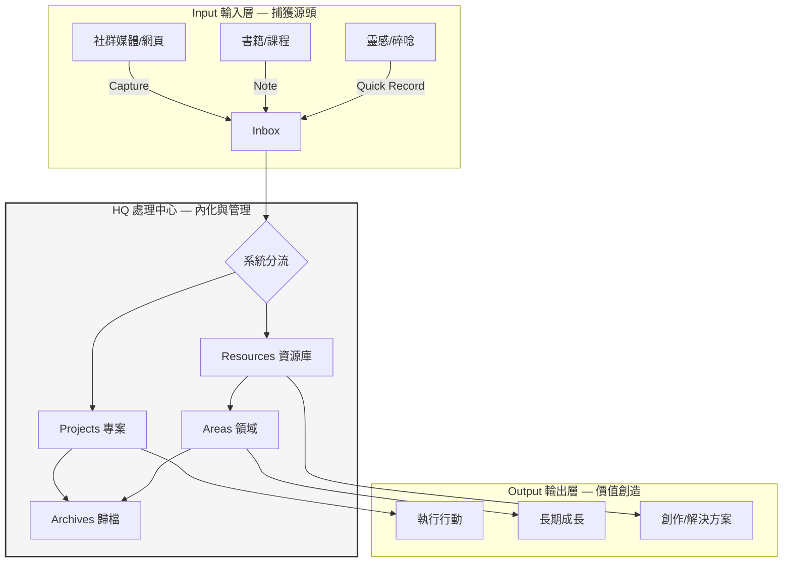

# Input-HQ-Output 模型

> [!abstract]+ 核心定義
> 系統化人生的頂層運作邏輯：**輸入（Input）→ 處理中心（HQ）→ 輸出（Output）** 的循環模型。所有外部資訊透過 HQ 的雙軌加工，最終轉化為有價值的產出或自我成長。

---

## 模型架構

---

## 三層職責

| 層 | 核心原則 | 目標 |
|---|---|---|
| **Input** | 快速捕獲，減少摩擦 | 讓工具負責儲存，大腦專心思考 |
| **HQ** | 分流與雙軌加工（PKM + PM） | 資訊內化為知識，行動转化为产出 |
| **Output** | 以終為始，行動導向 | 所有輸入最終必須有某種形式的產出 |

### 輸入層 (Input)

- **觸發點**：任何值得記住的資訊（所見、所讀、所想）
- **工具**：手機備忘錄、錄音、瀏覽器插件（Readwise、Web Clipper）、Obsidian Inbox
- **關鍵原則**：快速捕獲，減少摩擦。不讓大腦負擔瑣碎的儲存工作

### 處理中心 (HQ)

- **雙軌制**：見 [[L-036-PKM×PM雙軌制]]
- **分流邏輯**：資訊進入 HQ 後，自動分流至 PKM（沉澱為 Areas 智慧）或 PM（驅動 Projects 執行）

### 輸出層 (Output)

- **核心問題**：這份資訊最終要產生什麼價值？
- **產出形態**：執行行動、長期成長、創作內容、解決方案

---

## 與 Life OS 的關係

Input-HQ-Output 是 **Life OS 的頂層架構原則**。它解釋了：
- 外部資訊如何進系統（Input）
- 系統內部如何加工（HQ：PKM × PM）
- 系統如何產生價值（Output）

[[Life-OS-MOC|Life OS 總覽 →]]

---

## 相關頁面

- [[L-009-生命儀表板]] — 現有系統中相當於 Output 的視覺化呈現
- [[L-035-PARA四大分類法]] — HQ 內部的 PARA 分類狀態
- [[L-036-PKM×PM雙軌制]] — HQ 的兩種加工模式
- [[L-037-數位收納四層次]] — 系統建構的完整四層視角

^[raw/SRC-LifeOS-Impl-Guide-2026-04-30]

## 關聯知識 (Related)

- [[L-009-生命儀表板]]
- [[L-035-PARA四大分類法]]
- [[L-036-PKM×PM雙軌制]]
- [[L-037-數位收納四層次]]
- [[Life-OS-MOC]]]
