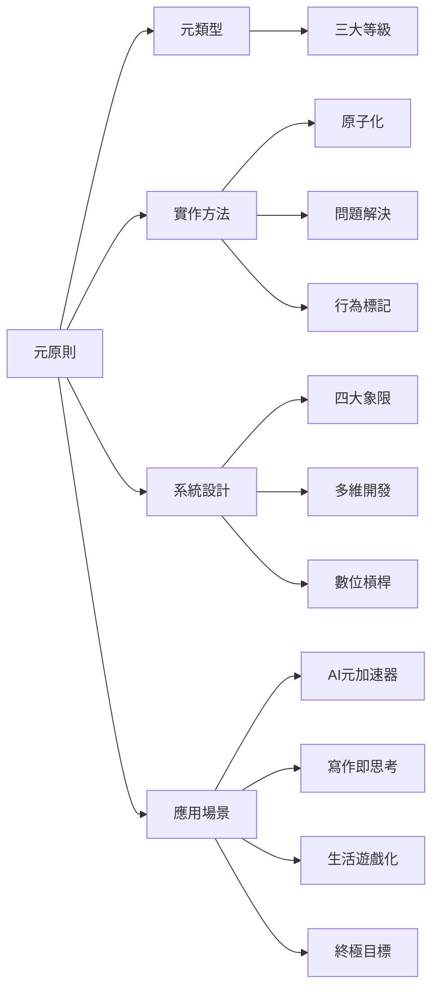

# H3.0 元系統 MOC

元系統相關原子化筆記的樞紐。

## 筆記清單

### 核心概念

| 筆記 | 標題 | 核心概念 |
|------|------|----------|
| [[H3.0-元原則]] | 元原則 | 系統底層原則 |
| [[H3.0-元類型計算機制]] | 元類型計算機制 | 類型計算方法 |
| [[H3.0-三大等級]] | 三大等級 | 等級分類系統 |

### 實作方法

| 筆記 | 標題 | 核心概念 |
|------|------|----------|
| [[H3.0-原子化實作清單]] | 原子化實作清單 | 實作步驟 |
| [[H3.0-問題解決流程]] | 問題解決流程 | 問題分析方法 |
| [[H3.0-行為標記]] | 行為標記 | 行為追蹤方法 |

### 系統設計

| 筆記 | 標題 | 核心概念 |
|------|------|----------|
| [[H3.0-四大象限]] | 四大象限 | 象限分類框架 |
| [[H3.0-多維開發]] | 多維開發 | 多維度分析方法 |
| [[H3.0-數位槓桿權力轉移]] | 數位槓桿權力轉移 | 槓桿原理 |

### 元危機與驅動因素

| 筆記 | 標題 | 核心概念 |
|------|------|----------|
| [[H3.0-元危機]] | 元危機 | 文明結構性轉折點 |
| [[H3.0-競爭性動態]] | 競爭性動態 | 零和賽局底層模式 |
| [[H3.0-基質消耗]] | 基質消耗 | 系統性崩潰根源 |
| [[H3.0-指數級技術]] | 指數級技術 | 技術超越適應能力 |

### 應用場景

| 筆記 | 標題 | 核心概念 |
|------|------|----------|
| [[H3.0-AI元加速器]] | AI元加速器 | AI 應用框架 |
| [[H3.0-寫作即思考]] | 寫作即思考 | 寫作方法論 |
| [[H3.0-生活遊戲化架構]] | 生活遊戲化架構 | 遊戲化設計 |
| [[H3.0-終極目標]] | 終極目標 | 目標設定框架 |

## 框架關聯

## 使用建議

- 系統建構：從 H3.0-元原則 開始
- 實作方法：參考 H3.0-原子化實作清單
- 應用延伸：依需求選擇 AI/寫作/遊戲化/目標模組

---

## Metadata

| Field | Value |
|-------|-------|
| Version | 0.1.0 |
| Last Updated | 2026-04-16 |
| Total Notes | 42 |