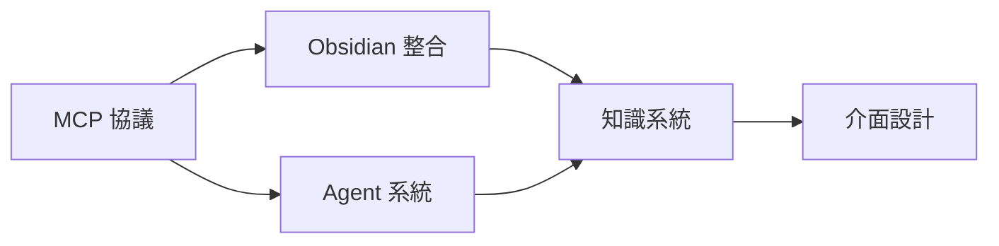

# K-AI 人工智慧系統 MOC

AI 與知識系統相關原子化筆記的樞紐。

## 筆記清單

|| 筆記 | 標題 | 核心概念 |
||------|------|----------|
|| [[K-SYS-037_24-7 自動化系統 (24-7 Automation System)]] | 24-7 自動化系統 | 數位價值創造自動化 |
|| [[K-AI-001_1_MCP基礎概念]] | MCP基礎概念 | 模型上下文協議基礎 |
| [[K-AI-001_2_MCPObsidian運作架構]] | MCPObsidian運作架構 | Obsidian 整合架構 |
| [[K-AI-001_3_Antigravity差異與Vault設計]] | Antigravity差異與Vault設計 | 系統設計差異 |
| [[K-AI-002_1_個人知識系統核心定位]] | 個人知識系統核心定位 | 系統定位方法 |
| [[K-AI-002_2_殺手級功能模組]] | 殺手級功能模組 | 核心功能設計 |
| [[K-AI-002_3_上下文治理層]] | 上下文治理層 | 上下文管理 |
| [[K-AI-003_1_介面架構]] | 介面架構 | UI/UX 設計 |
| [[K-AI-003_2_核心功能模組]] | 核心功能模組 | 功能模組設計 |

## 框架關聯

## 使用建議

- 系統建構：參考 K-AI-001 系列
- 功能設計：參考 K-AI-002 系列
- 介面規劃：參考 K-AI-003 系列

---

## Metadata

| Field | Value |
|-------|-------|
| Version | 0.1.0 |
| Last Updated | 2026-04-16 |
| Total Notes | 8 |