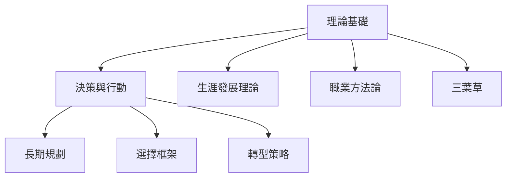

# K-CAREER 職業生涯 MOC

職業生涯相關原子化筆記的樞紐。

## 筆記清單

### 理論基礎

| 筆記 | 標題 | 核心概念 |
|------|------|----------|
| [[K-CAREER-001_生涯發展理論]] | 生涯發展理論 | 終身動態過程 |
| [[K-CAREER-002_職業規劃方法論]] | 職業規劃方法論 | 四大流程 |
| [[K-CAREER-003_職業三葉草]] | 職業三葉草 | 興趣×能力×價值 |

### 決策與行動

|  筆記 | 標題 | 核心概念 |
|------|------|----------|
| [[K-CAREER-004_職業選擇框架]] | 職業選擇框架 | 多維度決策 |
| [[K-CAREER-005_職業轉型策略]] | 職業轉型策略 | 系統化轉型 |
| [[K-CAREER-006-跨國生活環境四維度比較]] | 跨國生活環境四維度比較 | 生存×成長×文化×身份 |

### 長期規劃

| 筆記 | 標題 | 核心概念 |
|------|------|----------|
| [[K-CAREER-001_1_五年戰略概述]] | 五年戰略概述 | 長期規劃框架 |
| [[K-CAREER-001_2_前兩年規劃]] | 前兩年規劃 | 短期規劃 |

## 框架關聯

## 使用建議

- **起點**：從 K-CAREER-001 生涯發展理論 開始
- **自我定位**：用 K-CAREER-003 職業三葉草 找出交集
- **決策**：用 K-CAREER-004 職業選擇框架 評估選項
- **轉型**：用 K-CAREER-005 職業轉型策略 執行轉換

## 與其他 MOC 關係

- **上游**：L30_設計人生MOC（DYL 工具層）
- **下游**：主權人生 MOC（覺察層）

---

## Metadata

| Field | Value |
|-------|-------|
| Version | 0.3.0 |
| Last Updated | 2026-04-16 |
| Total Notes | 11 |