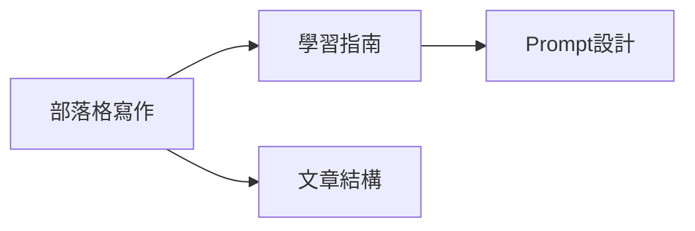

# K-CONTENT 內容創作 MOC

內容創作相關原子化筆記的樞紐。

## 筆記清單

||| 筆記 | 標題 | 核心概念 |
|||------|------|----------|
||| [[K-CONTENT-001_BPAS 寫作框架]] | BPAS 寫作框架 | 短內容擴展框架 |
||| [[K-CAREER-008_Cortex 寫作工作流 (Cortex Writing Workflow)]] | Cortex 寫作工作流 | 系統化寫作流程 |
||| [[K-BIZ-053_主題樹結構 (Topic Tree)]] | 主題樹結構 | 內容架構系統 |
||| [[K-CONTENT-001_1_清單型部落格文章Prompt]] | 清單型部落格文章Prompt | 寫作模板 |
|| [[K-CONTENT-001_2_學習指南Prompt結構]] | 學習指南Prompt結構 | 結構設計 |
|| [[K-CONTENT-001_3_整合Prompt設計原則]] | 整合Prompt設計原則 | Prompt工程 |
||| [[K-CONTENT-012_社群平台優先於部落格]] | 社群平台優先於部落格 | 演算法分發邏輯 |
||| [[K-CONTENT-013_標題具體性原則]] | 標題具體性原則 | 網絡標題四元素 |
||| [[K-CONTENT-014_內容測試漏斗]] | 內容測試漏斗 | 短文先行、長文後進 |
||| [[K-CONTENT-015_轉變故事鈎子框架]] | 轉變故事鈎子框架 | 開場轉變敘事 |
||| [[K-CONTENT-016_1-3-1段落節奏法]] | 1-3-1段落節奏法 | 段落節奏結構 |
||| [[K-CONTENT-017_社群排版格式化技巧]] | 社群排版格式化技巧 | 排版與格式化 |
||| [[K-CONTENT-018_Lean-Writing框架]] | Lean-Writing框架 | 數據驅動內容創作 |
||| [[K-CONTENT-019_自我介紹Bio框架]] | 自我介紹Bio框架 | 讀者導向自我定位 |
||| [[K-CONTENT-020_主題聚焦策略]] | 主題聚焦策略 | 探索→聚焦→深耕 |

## 框架關聯

## 使用建議

- 寫作模板：參考 K-CONTENT-001-1
- 結構設計：參考 K-CONTENT-001-2
- Prompt工程：參考 K-CONTENT-001-3

---

## Metadata

| Field | Value |
|-------|-------|
| Version | 0.1.0 |
| Last Updated | 2026-05-03 |
| Total Notes | 13 |