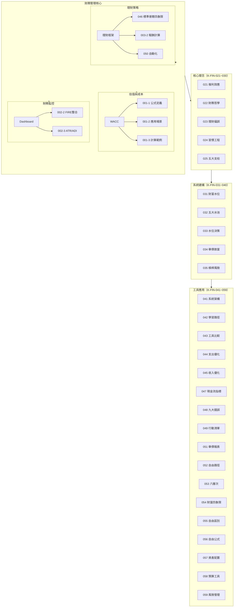

# K-FIN 財務管理 MOC

> 財務管理相關原子筆記樞紐

---

## 筆記清單

| 編號 | 筆記名稱 | 主題 |
|:----:|----------|------|
| K-FIN-001-1 | WACC公式與定義 | 權平均資本成本公式與定義 |
| K-FIN-001-2 | WACC應用場景 | WACC在各類決策中的應用 |
| K-FIN-001-3 | WACC計算範例 | 實際計算範例與步驟 |
| K-FIN-002-1 | 財務Dashboard結構與模組 | 財務儀表板設計架構 |
| K-FIN-002-2 | FIRE與標準普爾整合 | FIRE運動與標普普爾模型整合 |
| K-FIN-002-3 | ATR與ADI指標應用 | ATR波動率與ADI應用 |
| K-FIN-003-1 | SP四象限與六罐子整合 | SP框架與六罐子理財整合 |
| K-FIN-003-2 | 報酬計算方法 | 各類投資報酬計算方式 |
| K-FIN-003-3 | 自動化財務系統與緊急預備金 | 自動化理財系統建構 |
| K-FIN-020 | 記帳APP可行性分析 | AI輔助開發評估 |
| K-FIN-021 | 理財核心理念 | 複利效應與時間槓桿 |
| K-FIN-022 | 財務哲學與價值觀 | 價值觀、金錢觀與人生目標 |
| K-FIN-023 | 理財偏誤識別與克服 | 常見認知偏誤與心理陷阱 |
| K-FIN-024 | 習慣工程學 | 意志力、自動化與系統建構 |
| K-FIN-025 | 財務規劃五大支柱 | 現金流、儲蓄、投資、風險、策略 |
| K-FIN-026 | 現金流與債務管理系統 | 收入、支出、債務優先順序 |
| K-FIN-027 | 儲蓄管理 | 儲蓄率、先存後花原則 |
| K-FIN-028 | 投資規劃系統 | 資產配置、投資策略、長期持有 |
| K-FIN-029 | 風險管理與保險 | 保險、緊急預備金、風險矩陣 |
| K-FIN-030 | 財務自由 | 被動收入、財富自由定義與層次 |
| K-FIN-031 | 財富水位八大階段 | 財富累積階梯模型 |
| K-FIN-032 | 五大水池系統 | 資金分配的五大帳戶框架 |
| K-FIN-033 | 水位導向決策矩陣 | 根據財富水位選擇策略 |
| K-FIN-034 | 舉債致富策略 | 槓桿操作與利差思維 |
| K-FIN-035 | 槓桿投資風險管理 | 槓桿風險控制與防線 |
| K-FIN-036 | AI理財顧問與數位金融 | 數位工具與AI輔助理財 |
| K-FIN-037 | 加密貨幣投資 | 加密資產基本認識與風險 |
| K-FIN-038 | FIRE運動與財務獨立 | FIRE流派與財務獨立路徑 |
| K-FIN-039 | 交易風險容忍度協議 | 離職風險、交易風險承受度 |
| K-FIN-040 | 新手投資路徑 | 初學者投資學習階梯 |
| K-FIN-041 | 個人財務知識系統架構 | 理財知識金字塔與系統架構 |
| K-FIN-042 | 理財學習路徑指南 | 從入門到專業的學習地圖 |
| K-FIN-043 | 投資工具比較分析 | ETF、主動基金、股票、債券比較 |
| K-FIN-044 | 支出優化策略 | 消費取捨、支出削減方法 |
| K-FIN-045 | 收入優化策略 | 收入提升、多收入管道建立 |
| K-FIN-046 | 標準普爾四象限配置法 | 標準普爾家庭資產配置模型 |
| K-FIN-047 | 現金流分析關鍵指標 | 現金流健康度評估指標 |
| K-FIN-048 | 理財九大常犯錯誤 | 常見理財錯誤與避免方法 |
| K-FIN-049 | 財務行動指引清單 | 立即可執行的行動項目 |
| K-FIN-050 | 財務自動化實踐指南 | 自動化轉帳與系統建構步驟 |
| K-FIN-051 | 舉債致富分析報表 | 槓桿操作範例與還款策略 |
| K-FIN-052 | 財務自由實現路徑 | FIRE計算與達成路徑 |
| K-FIN-053 | 財務自由六層次 | 財務自由的六個階段與定義 |
| K-FIN-054 | 財富四象限理論 | 現金流四象限（E/S/B/I） |
| K-FIN-055 | 財富自由與財務自由區別 | 兩種自由的概念釐清 |
| K-FIN-056 | 財務自由公式 | 財務自由的數學模型 |
| K-FIN-057 | 資產配置策略 | 股債配置、年齡配置策略 |
| K-FIN-058 | 預算管理工具大全 | 預算工具、記帳方法、 apps |
| K-FIN-059 | 風險管理實務流程 | 風險識別、風險評估、風險對沖 |
| K-FIN-001 | 投資基礎概念 | 投資標的、風險報酬原則 |
| K-FIN-002 | 儲蓄基礎 | 儲蓄目標、儲蓄紀律 |
| K-FIN-003 | 個人預算管理 | 預算編列、執行監控 |
| K-FIN-004 | 債務管理原則 | 債務類型、還款策略 |
| K-FIN-005 | 循環信貸（左輪手槍） | 企業循環信貸、財務模型 |
| K-FIN-006 | 個人循環信貸管理 | 個人FCF管理、緊急備用金 |
| K-FIN-007 | 理財策略決策框架 | 三階段財富積累、杠桿運用 |
| K-FIN-008 | 財商框架 | 四大思維、收入/支出/資產分類 |
| K-FIN-009 | 財富流沙盤與人生設計 | 沙盤策略、現實遷移 |

---

## 框架關聯圖

---

## 知識領域分類

| 領域 | 筆記範圍 |
|------|----------|
| 估值與成本 | WACC 計算與應用 |
| 財務監控 | Dashboard、FIRE、指數 |
| 理財策略 | 資產配置、報酬計算、自動化 |
| 核心理念 | 複利、思維基石、習慣工程 |
| 系統建構 | 水位系統、五水池、槓桿策略 |
| 工具應用 | 投資工具、預算、風險管理 |

---

## 使用建議

### 學習路徑

1. **核心理念**：K-FIN-021 → 022 → 023 → 024 → 025（建立思維與系統觀）
2. **系統建構**：K-FIN-030 → 031 → 032 → 033 → 034 → 035（理解水位與槓桿）
3. **工具應用**：K-FIN-041 → 042 → 043 ~ 059（依需求查閱）
4. **基礎複習**：K-FIN-001 → 002 → 003（舊有體系）

### 應用場景

- 投資決策資本成本計算
- 個人財務儀表板建構
- FIRE 財務自由規劃
- 資產配置與風險管理
- 消費習慣與支出優化
- 收入提升與多收入管道

---

## 相關 MOC

- [[K-TRADING_交易與投資_MOC]] - 交易與投資知識
- [[K-SYS_知識管理系統_MOC]] - 知識管理系統

---

## 來源

本 MOC 收錄的原子頁面，部分來自用戶原創教材蒸餾：
`30_Projects/34_On-hold/330個人金融知識庫/`

| K-FIN-043 | 投資標的比較 | 股票/基金/ETF完整比較表 |
| K-FIN-044 | ETF完整指南 | ETF優缺點、費用結構 |
| K-FIN-045 | 股票投資基礎 | 分散投資、配息與填息 |
| K-FIN-046 | 海龜交易法 | 趨勢跟隨系統與技術指標 |
| K-FIN-047 | 混沌交易法 | Bill Williams混沌理論與鱷魚指標 |
| K-FIN-048 | 被動投資 | 買進持有、巴菲特建議、長期複利 |

---

*此 MOC 為 K-FIN 系列的入口筆記，建議依學習路徑順序閱讀原子筆記。*
