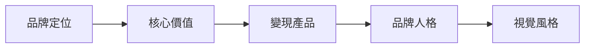

# K-MKT 品牌與行銷 MOC

品牌與行銷相關原子化筆記的樞紐。

## 筆記清單

|| 筆記 | 標題 | 核心概念 |
||------|------|----------|
|| [[K-BIZ-056_五大意識層級 (Five Levels of Awareness)]] | 五大意識層級 | 受眾認知狀態 |
|| [[K-BIZ-057_人格錨點與真實性 (Personality Anchors and Authenticity)]] | 人格錨點與真實性 | AI時代信任錨點 |
|| [[K-MKT-001_1_個人品牌核心定位]] | 個人品牌核心定位 | 品牌定位 |
| [[K-MKT-001_2_核心價值與變現產品]] | 核心價值與變現產品 | 價值轉化 |
| [[K-MKT-001_3_品牌人格與視覺風格]] | 品牌人格與視覺風格 | 品牌設計 |
| [[K-MKT-001_4_大頭貼設計原則]] | 大頭貼設計原則 | 視覺設計 |

## 框架關聯

## 使用建議

- 品牌建立：從 K-MKT-001-1 開始
- 視覺設計：參考 K-MKT-001-3/4

---

## Metadata

| Field | Value |
|-------|-------|
| Version | 0.1.0 |
| Last Updated | 2026-04-16 |
| Total Notes | 4 |