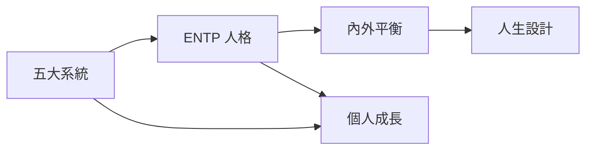

# K-SELF 自我成長 MOC

自我成長與人格特質相關原子化筆記的樞紐。

## 筆記清單

### 系統化框架

|  筆記 | 標題 | 核心概念 |
|------|------|----------|
| [[K-SELF-001_1_五大系統核心概念]] | 五大系統核心概念 | 系統化成功原則 |
| [[K-SELF-001_2_五大系統詳細內容]] | 五大系統詳細內容 | 系統詳細解說 |
| [[K-SELF-001_3_五大系統應用步驟]] | 五大系統應用步驟 | 實踐方法 |
| [[K-SELF-004_1_系統化成功原則]] | 系統化成功原則 | 系統 > 意志力核心區分 |

### Ali Abdaal 系統化思想

|  筆記 | 標題 | 核心概念 |
|------|------|----------|
| [[K-SELF-004_1_系統化成功原則]] | 系統化成功原則 | 系統 > 意志力 |

### 人格分析

| 筆記 | 標題 | 核心概念 |
|------|------|----------|
| [[K-SELF-002_1_ENTP核心特質]] | ENTp核心特質 | 人格分析 |
| [[K-SELF-002_2_ENTP七大成長方向]] | ENTp七大成長方向 | 成長路徑 |
| [[K-SELF-002_3_ENTP成長核心原則]] | ENTp成長核心原則 | 核心原則 |

### 平衡框架

| 筆記 | 標題 | 核心概念 |
|------|------|----------|
| [[K-SELF-003_1_內外平衡四大象限]] | 內外平衡四大象限 | 平衡框架 |
| [[K-SELF-003_2_內外平衡應用方法]] | 內外平衡應用方法 | 實踐應用 |

### 人生領域診斷

||  筆記 | 標題 | 核心概念 |
||------|------|----------|
|| [[K-SELF-010_自我身份練習]] | 自我身份練習 | 多元身份探索，發現核心自我 |
|| [[八大人生領域]] | 八大人生領域 | 自我診斷與能量管理框架 |
|| [[K-000-價值觀探索]] | 價值觀探索 | 價值觀萃取/衝突檢測/動機類型/系統穩定性審計 |

## 缺口（Gap）

<!-- INGEST 完成後在此標注已被補足的缺口 -->
- [x] K-000-價值觀探索（價值觀衝突檢測、動機類型區分、系統穩定性審計）— 2026-05-05 — 已補足（蒸餾自 330人生航道/自適應訪談模板 + Arena-進化追蹤卡片模板）

## 框架關聯

## 使用建議

- 系統化成長：參考 K-SELF-001 系列
- 人格理解：參考 K-SELF-002 系列
- 平衡生活：參考 K-SELF-003 系列

---

| [[K-SELF-005_12週年度執行系統]] | 12週年度執行系統 | 90天高強度執行周期，提升緊迫感 |
| [[K-SELF-006_個人商業模式圖]] | 個人商業模式圖 | BMY九宮格，系統化職涯規劃 |
| [[K-SELF-007_五大資產框架]] | 五大資產框架 | 時間/社會/心理/身體/金錢五維財富觀 |
| [[K-SELF-008_限制性信念與突破]] | 限制性信念與突破 | 信念清除、情緒轉化、經驗重構 |
| [[K-SELF-009_夢想系統實作]] | 夢想系統實作 | 九宮格/終極劇本/富裕筆記工具集 |
| [[K-SELF-010_高效率人生管理系統框架]] | 高效率人生管理系統框架 | 六階段成長飛輪筆記系統 |
| [[K-SELF-011_生命之輪]] | 生命之輪 | 八大面向平衡診斷工具 |

## Metadata

| Field | Value |
|-------|-------|
| Version | 0.1.0 |
| Last Updated | 2026-04-16 |
| Total Notes | 8 |