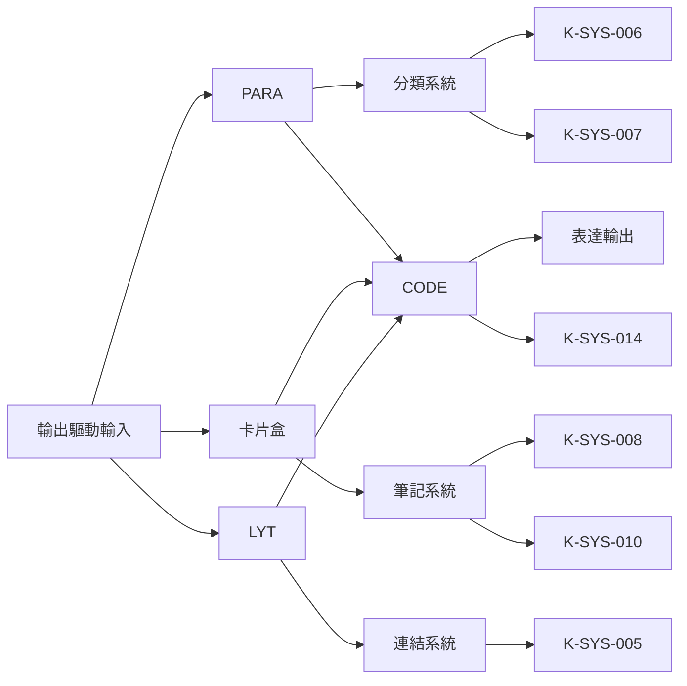
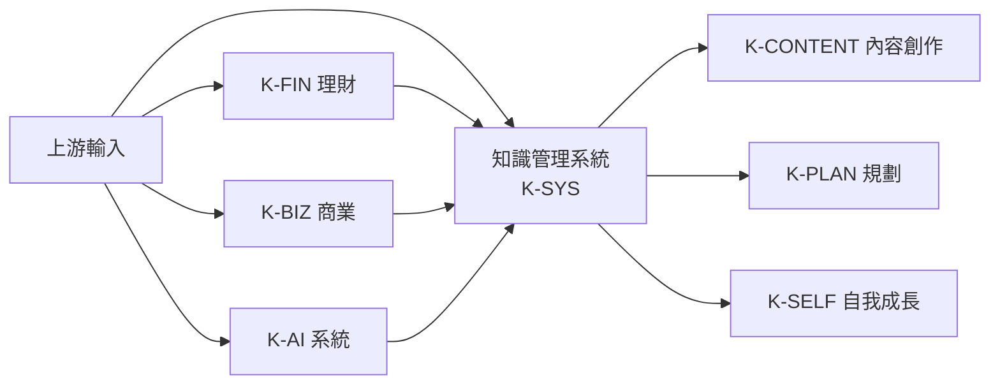

# K-SYS 知識管理系統 MOC

知識管理系統相關原子化筆記的樞紐，涵蓋 PARA、卡片盒、LYT、CODE 等主流框架。

## 筆記分類

### 1. 核心框架 (Core Frameworks)

| 筆記 | 標題 | 核心概念 |
|------|------|----------|
| [[K-SYS-006_行動分類]] | PARA行動分類 | 從資訊超載到精準行動 |
| [[K-SYS-007_行動力光譜]] | PARA行動力光譜 | 直覺化分類決策框架 |
| [[K-SYS-018_PARA數位架構]] | PARA數位架構 | 專案vs領域區分 |
| [[K-SYS-019_PARA實踐步驟]] | PARA實踐步驟 | 資訊破產宣言 |
| [[K-SYS-014_CODE框架]] | CODE知識管理框架 | Capture-Organize-Distill-Express |
| [[K-SYS-015_第二大腦建構]] | 第二大腦建構 | 認知卸載與數位主權 |

### 2. 筆記方法論 (Note Methodologies)

| 筆記 | 標題 | 核心概念 |
|------|------|----------|
| [[K-SYS-008_卡片盒筆記法]] | 卡片盒筆記法 | 原子化、自律性、湧現 |
| [[K-SYS-010_卡片盒術語澄清]] | 卡片盒術語澄清 | 魯曼原始體系 vs 阿倫斯詮釋版 |
| [[K-SYS-017_卡片盒湧現原理]] | 卡片盒湧現原理 | 原子化與自律性原則 |
| [[K-SYS-011_三大核心筆記]] | 三大核心筆記 | 閃念→文獻→永久筆記生命週期 |
| [[K-SYS-005_網路化思考]] | LYT網路化思考 | 從記錄到創作的範式轉移 |
| [[K-SYS-016_數位花園與NOMA方法]] | 數位花園NOMA方法 | NOMA 四問驅動思考 |

### 3. 知識湧現與架構 (Knowledge Emergence & Architecture)

| 筆記 | 標題 | 核心概念 |
|------|------|----------|
| [[K-SYS-009_知識湧現架構]] | 知識湧現架構 | 五層次湧現模型 |
| [[K-SYS-004_AI驅動知識湧現]] | AI驅動知識湧現 | AI 無感組織與 NOMA |

### 4. 心理與陷阱 (Psychology & Traps)

| 筆記 | 標題 | 核心概念 |
|------|------|----------|
| [[K-SYS-012_收藏者謬誤]] | 收藏者謬誤克服 | 三分鐘加工檢核 |
| [[K-SYS-013_筆記策略比較]] | 筆記策略深度比較 | 四種策略成本與適用場景 |

### 5. 系統診斷 (System Diagnostics)

| 筆記 | 標題 | 核心概念 |
|------|------|----------|
| [[K-SYS-001_系統現有架構]] | NaviHelios現有架構 | Vault 架構現況 |
| [[K-SYS-002_系統關鍵問題]] | NaviHelios關鍵問題 | 系統問題診斷 |
| [[K-SYS-003_系統優化建議]] | NaviHelios優化建議 | 優化方向建議 |

---

## 知識網絡

### 框架關聯圖（Mermaid）

### 上下游關聯（Mermaid）

---

## Metadata

| Field | Value |
|-------|-------|
| Version | 0.2.0 |
| Last Updated | 2026-04-26 |
| Author | hermes |
| Total Notes | 19 |

## Changelog

| Version | Date | Author | Change |
|---------|------|--------|--------|
| 0.1.0 | 2026-04-15 | doc-editor | Initial MOC |
| 0.1.1 | 2026-04-16 | doc-editor | 改用 Mermaid 縱向圖表 |
| 0.2.0 | 2026-04-26 | hermes | 蒸餾完成，wikilinks 全面更新 |
