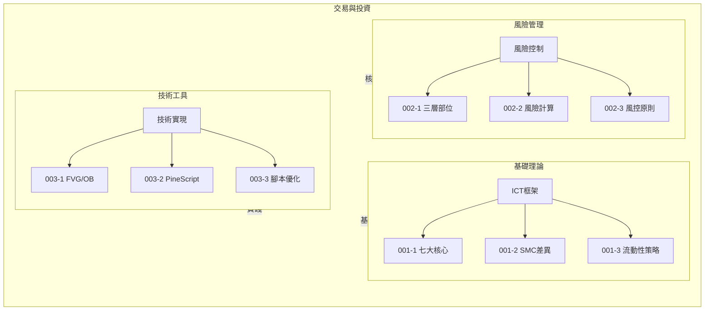

# K-TRADING 交易與投資 MOC

> 交易與投資相關原子筆記樞紐

---

## 筆記清單

| 編號 | 筆記名稱 | 主題 |
|:----:|----------|------|
| K-TRADING-001-1 | ICT七大核心概念 | ICT 核心框架與原理 |
| K-TRADING-001-2 | ICT與SMC差異 | 內部者交易與機構交易對比 |
| K-TRADING-001-3 | 流動性抓取訂單區反轉策略 | 流動性捕獲與訂單區策略 |
| K-TRADING-002-1 | 三層部位分類 | 部位規模與風險分層 |
| K-TRADING-002-2 | 風險計算核心邏輯 | 風險評估與計算方式 |
| K-TRADING-002-3 | 風險控制原則與輸入欄位 | 風控原則與關鍵參數 |
| K-TRADING-003-1 | FVG與OB核心概念 | 公平價值缺口與訂單區塊 |
| K-TRADING-003-2 | PineScript腳本功能 | TradingView 腳本開發 |
| K-TRADING-003-3 | 腳本潛在優化 | 腳本效能優化方向 |
| K-TRADING-001 | 投資標的比較 | 股票/基金/ETF完整比較表 |
| K-TRADING-002 | ETF完整指南 | ETF優缺點、費用結構 |
| K-TRADING-003 | 股票投資基礎 | 分散投資、配息與填息 |
| K-TRADING-004 | 海龜交易法 | 趨勢跟隨系統與技術指標 |
| K-TRADING-005 | 混沌交易法 | Bill Williams混沌理論與鱷魚指標 |
| K-TRADING-006 | 被動投資 | 買進持有、巴菲特建議、長期複利 |

---

## 框架關聯圖

---

## 框架關聯圖

---

## 知識領域分類

| 領域 | 筆記範圍 |
|------|----------|
| 基礎理論 | ICT、SMC、流動性策略 |
| 風險管理 | 部位計算、風險控制 |
| 技術工具 | FVG/OB、PineScript |

---

## 使用建議

### 學習路徑

1. **理論基礎**：先讀 K-TRADING-001 系列，掌握 ICT 核心概念
2. **風險優先**：接續 K-TRADING-002 系列，建立風險管理框架
3. **技術實踐**：最後讀 K-TRADING-003 系列，實現策略自動化

### 應用場景

- 金融市場技術分析
- 短線交易策略開發
- 部位與風險管理
- TradingView 腳本編寫

---

## 相關 MOC

- [[K-FIN_財務管理_MOC]] - 財務管理知識
- [[K-SYS_知識管理系統_MOC]] - 知識管理系統

---

*此 MOC 為 K-TRADING 系列的入口筆記，建議依學習路徑順序閱讀原子筆記。*

