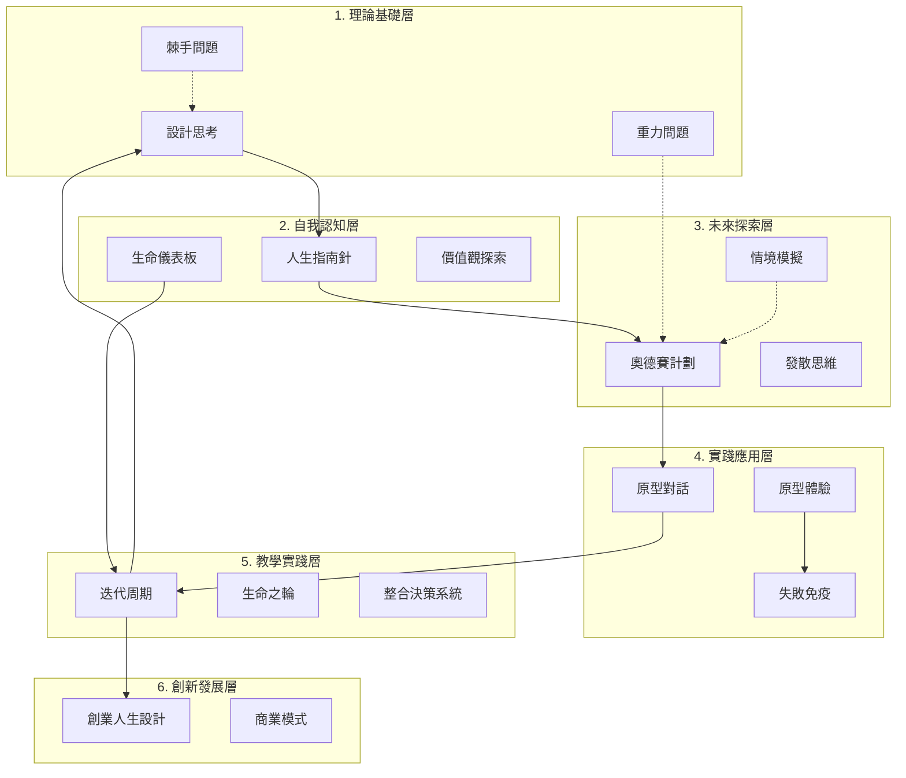

# L-30 設計人生 MOC

> 將設計思考應用於個人發展，將生活視為一個持續設計的專案，幫助在充滿不確定性的現代社會中，創造有意義且可持續的生活方式。

## 概述

**核心定位**：系統性人生設計方法論的總樞紐

**與其他 MOC 的關係**：
- 下游：人生設計 (Life Design MOC) - 商業應用
- 相關：主權人生 MOC、H3.0 元系統

---

## 知識體系架構

人生設計整合了六個層次，每層包含核心概念、關鍵工具與應用組合：

### 1. 理論基礎層
**核心概念**：設計思考、重力問題、棘手問題、同理心、好奇心、行動偏誤、重擬問題

**關鍵工具**：

| 筆記 | 說明 |
|------|------|
| [[L-001-設計思考五大階段]] | 同理→定義→發想→原型→測試 |
| [[L-002-設計師五種心態]] | 好奇心、行動偏誤、重擬問題、覺察、通力合作 |
| [[L-003-生涯混沌理論]] | 非線性生涯發展 |
| [[L-004-計劃性偶發理論]] | 創造幸運 |
| [[L-005-發散思維]] | 大量產生想法 |
| [[L-006-重力問題]] | 可改變 vs 不可改變 |
| [[L-007-棘手問題]] | 無法完美解決的複雜問題 |
| [[L-020-人生設計十框架]] | 十個設計師思維框架 |

**應用組合**：
- 構成：設計思考 + 棘手問題 + 同理心
- 效果：建立系統性問題解決思維
- 應用：複雜問題處理、人生轉型、決策制定

---

### 2. 自我認知層
**核心概念**：工作觀、生活觀、價值觀、好奇心、身份認同

**關鍵工具**：

| 筆記 | 標題 | 說明 |
|------|------|------|
| [[L-008-人生指南針]] | 人生指南針 | 工作觀 + 人生觀探索 |
| [[L-009-生命儀表板]] | 生命儀表板 | 四維度生活評估 |
| [[L-010-時光日誌]] | 時光日誌 | 能量覺察工具 |
| [[K-SELF-025_MBTI性格測驗]] | MBTI性格測驗 | 性格類型評估 |
| [[K-SELF-027_大五人格測驗]] | 大五人格測驗 | 五維度人格模型 |
| [[K-SELF-029_蓋洛普優勢測驗]] | 蓋洛普優勢測驗 | 天賦識別 |
| [[K-SELF-028_生命之輪]] | 生命之輪 | 八維度滿意度評估 |
| [[K-SELF-026_價值觀探索]] | 價值觀探索 | 核心信念識別 |
| [[L-024-生命歷程探索]] | 生命歷程探索 | 時間軸繪製 |
| [[八大人生領域]] | 八大人生領域 | 自我診斷框架 |

**應用組合**：
- 構成：人生指南針 + 生命儀表板 + 價值觀探索 + 八大人生領域
- 效果：建立清晰的人生方向指引
- 應用：人生重大決策、職業轉換、生活調整

---

### 3. 未來探索層
**核心概念**：奧德賽計劃、多元未來思維、多重路徑、計劃性偶發

**關鍵工具**：

| 筆記 | 標題 | 說明 |
|------|------|------|
| [[L-011-奧德賽計劃]] | 奧德賽計劃 | 三版本五年計劃 |
| [[L-005-發散思維]] | 發散思維 | 大量產生想法 |
| [[L-004-計劃性偶發理論]] | 計劃性偶發理論 | 創造幸運 |
| [[L-019-情境模擬練習]] | 情境模擬練習 | 五年後的一天 |
| [[K-SYS-040_人生終極劇本]] | 人生終極劇本 | 設計遺產方法 |

**應用組合**：
- 構成：奧德賽計劃 + 情境模擬 + 發散思維 + 計劃性偶發理論
- 效果：系統性探索不同人生可能性，創造幸運
- 應用：職業規劃、生活轉型、創業探索

---

### 4. 實踐應用層
**核心概念**：原型製作、快速迭代、失敗免疫、持續改進

**關鍵工��**：

| 筆記 | 標題 | 說明 |
|------|------|------|
| [[L-012-原型對話]] | 原型對話 | 資訊訪談 |
| [[L-013-原型體驗]] | 原型體驗 | 實際行動驗證 |
| [[L-014-失敗免疫]] | 失敗免疫 | 失敗重框架 |
| [[L-015-心理彈性]] | 心理彈性 | 心理韌性建立 |
| [[L-016-失敗想像練習]] | 失敗想像練習 | 最糟情況模擬 |
| [[L-021-原型失敗處理]] | 原型失敗處理 | 失敗應對策略 |
| [[L-022-原型設計倫理]] | 原型設計倫理 | 訪談倫理指南 |

**應用組合**：
- 構成：原型對話 + 原型體驗 + 失敗免疫 + 失敗想像練習
- 效果：驗證並從失敗中學習，建立心理韌性
- 應用：職業轉型、生活調整、關係改善

---

### 5. 教學實踐層
**核心概念**：體驗學習、互動反饋、迭代周期、團隊協作

**關鍵工具**：

| 筆記 | 標題 | 說明 |
|------|------|------|
| [[L-017-整合決策系統]] | 整合決策系統 | 四種思維方式決策 |
| [[L-018-迭代周期]] | 迭代周期 | 定期檢視節奏 |
| [[L-023-人生設計團隊]] | 人生設計團隊 | 支援網絡建立 |

**應用組合**：
- 構成：迭代周期 + 生命之輪 + 整合決策系統 + 人生設計團隊
- 效果：持續調整與優化人生方向，獲得多元視角支持
- 應用：定期檢視、重大決策、生活平衡、團隊協作

---

### 6. 創新發展層
**核心概念**：數位工具、創業思維、商業模式、跨域整合

**關鍵工具**：

| 筆記 | 標題 | 說明 |
|------|------|------|
| [[L-025-創業人生設計]] | 創業人生設計 (ELD) | 創業心態 + 設計思考整合 |
| [[L-026-人生設計vs商業模式]] | 人生設計 vs 商業模式 | 兩種規劃工具比較 |

**應用組合**：
- 構成：創業人生設計 (ELD) + 商業模式思考
- 效果：將人生設計應用於創業與商業實踐
- 應用：一人公司、產品變現、品牌建立

---

## 實踐流程

### 設計人生的基本流程

1. **建立設計思考基礎** → 理解底層邏輯
2. **發展自我認知** → 清楚我是誰、我要什麼
3. **設計多元未來** → 擴展選項、打破線性思維
4. **原型測試與驗證** → 用最小成本驗證假設
5. **持續迭代與調整** → 保持方向與時俱進

---

## 實踐案例

**職業轉型探索**：從工程師轉向產品設計，使用奧德賽計劃設計三個可能的轉型路徑，透過原型對話獲得第一手市場洞察。

**創業探索**：使用奧德賽計劃設計創業方向，透過原型體驗驗證市場需求。

**生活平衡實驗**：整合生命之輪、迭代周期與時光日誌，建立平衡的生活方式。

---

## 參考資源

**理論基礎**
- 《設計你的人生》- Bill Burnett & Dave Evans
- 《設計思考工具包》
- 《設計師的五種心態》

**延伸框架**
- 《創業人生設計》(Entrepreneurial Life Design)
- 《高效率人生管理筆記》(水晶) - 人生終極劇本

---

## Mermaid 流程圖

---

| L-027 | 三層世界觀 | 人生設計/財富流 |
| L-028 | 三種贏家 | 人生設計/財富流 |
| L-029 | 五大元素 | 人生設計/財富流 |
| L-030 | 低成本試錯 | 人生設計/財富流 |
| L-031 | 健康智商 | 人生設計/財富流 |
| L-032 | 價值觀整合 | 人生設計/財富流 |
| L-033 | 六大商數系統 | 人生設計/財富流 |
| L-034 | 奧德賽整合 | 人生設計/財富流 |
| L-035 | 富而喜悅 | 人生設計/財富流 |
| L-036 | 平流層 | 人生設計/財富流 |
| L-037 | 情緒智商 | 人生設計/財富流 |
| L-038 | 教練引導 | 人生設計/財富流 |
| L-039 | 沙盤推演流程 | 人生設計/財富流 |
| L-040 | 玩商 | 人生設計/財富流 |
| L-041 | 生命之輪整合 | 人生設計/財富流 |
| L-042 | 精力系統 | 人生設計/財富流 |
| L-043 | 行情卡 | 人生設計/財富流 |
| L-044 | 覺察卡 | 人生設計/財富流 |
| L-045 | 覺察商 | 人生設計/財富流 |
| L-046 | 財務報表 | 人生設計/財富流 |
| L-047 | 財富智商 | 人生設計/財富流 |
| L-048 | 逆流層 | 人生設計/財富流 |
| L-049 | 順流層 | 人生設計/財富流 |

## Metadata

| Field | Value |
|-------|-------|
| Version | 1.0.0 |
| Last Updated | 2026-04-23 |
| Total Notes | 26 |
| Layers | 6 |
| Status | 融合版 (L30 + 知識矩陣) |