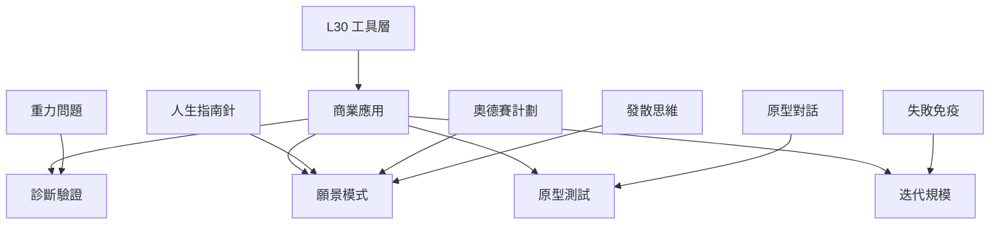

# 人生設計 - DYL 商業應用 MOC

將 Stanford DYL 框架應用於一人公司/商業實務。

## 商業應用模組

### 階段 I：診斷與市場驗證
| 筆記 | 標題 | 應用 |
|------|------|------|
| [[MVP-最小可行性產品]] | 最小可行性產品 | 用最小成本驗證假設 |
| [[行動偏誤]] | 行動偏誤 | 優先行動，快速獲取反饋 |
| [[主約束因素診斷]] | 主約束因素 | 識別當前最關鍵問題 |

### 階段 II：願景與商業模式
| 筆記 | 標題 | 應用 |
|------|------|------|
| [[奧德賽計劃-商業版]] | 奧德賽商業版 | 三種商業可能 |
| [[個人品牌核心提取]] | 品牌核心 | 定位獨特價值 |
| [[變現三位一體]] | 變現三位一體 | 產品/服務/內容變現 |

### 階段 III：原型與測試
| 筆記 | 標題 | 應用 |
|------|------|------|
| [[原型對話-商業版]] | 商業訪談 | 與潛在客戶對話 |
| [[原型實驗-商業版]] | 商業原型 | 小規模測試商業假設 |
| [[L-033-財富流與人生設計]] | 財富流×人生設計 | 財務模型整合 |
| [[轉向决策矩陣]] | Pivot 矩阵 | 策略調整依據 |

### 階段 IV：迭代與規模化
| 筆記 | 標題 | 應用 |
|------|------|------|
| [[品牌與變現架構]] | 品牌變現 | 長期價值獲取 |
| [[數位工具箱]] | 自動化 | 系統效率化 |
| [[多元變現]] | 多元變現 | 反脆弱戰術 |

## 與 L30 工具層的關係

## 使用建議

1. **從 L30 工具開始**：先完成人生指南針/奧德賽計劃
2. **商業診斷**：用 MVP 驗證市場假設
3. **願景設計**：建立品牌核心與變現模式
4. **原型測試**：商業訪談 + 小規模測試
5. **迭代規模**：多元變現 + 自動化

## 與其他 MOC 關係

- **上游**：L30_設計人生MOC（工具層）
- **下游**：主權人生 MOC（覺察層）
- **跨框架**：[[創業人生設計]] (ELD)

---

## Metadata

| Field | Value |
|-------|-------|
| Version | 0.2.0 |
| Last Updated | 2026-04-16 |
| Parent MOC | L30 |