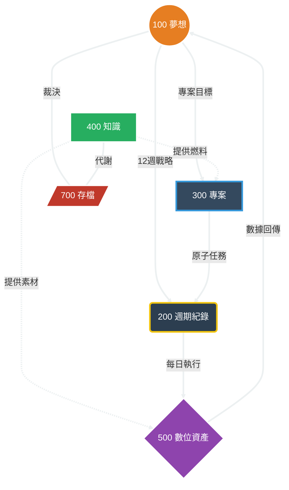

---
status: doing
priority: "高"
created: 2025-01-27
modified: 2025-01-27
tags: [系統/專案]
  - "系統/支援"
  - "類型/指南"
  - "類型/規則"
  - "象限/職業"
  - "狀態/進行中"
  - "優先/高"
  - "主題/系統設計"
  - "主題/專案管理"
title: "Navi Helios 12週主權系統 3.0 完整架構文件"
version: "3.0"
---
# Navi Helios 12週主權系統 3.0 完整架構文件

## 一、系統總體架構


### 1.1 核心設計理念

本系統採用「權力下行」邏輯，數字越小權限越高。系統以 **12週循環** 為核心時間單位，結合 **戰略裁決** 與 **執行問責** 機制，確保每個行動都有明確的權力來源和成果追蹤。

### 1.2 完整資料夾架構

```
Navi Helios 3.5/
│
├── 000 捕獲/                  # 【入口】7天審判區，存放外部原始碎片
│
├── 100 夢想/                  # 【主權區】原指揮中樞，系統最高權力來源
│   ├── 110 願景板筆記.md       # 夢想九宮格、人生三問（權力起點）
│   ├── 120 12週主控台.md       # 戰略目標、權重分配、每週計分彙整
│   ├── 130 KPI 數據儀表板.md   # 現金流與影響力（Dataview 自動化）
│   └── 140 Kill_List.md       # 專案與投資池的殘酷裁決處
│
├── 200 週期紀錄/             # 【執行區】原夢想與軌跡，唯一執行端
│   ├── 210 日誌/              # 【唯一戰場】子彈捕獲、MITs、解釋義務
│   ├── 220 任務/             # 日常任務、專案任務
│   └── 230 週期性覆盤/        # 週、月、季、年誌（戰略校準）
│
├── 300 專案/                 # 【骨幹區】原領域與專案，執行實體
│   ├── 專案A/
│   │   ├── 專案儀表板.md       # 里程碑與風險
│   │   └── 專案文件與資源/
│   └── _專案索引MOC.md         # 全專案狀態概覽（Dataview）
│
├── 400 知識/                 # 【燃料區】代謝驅動的 MOC 結構
│   ├── 410 專案知識MOC/       # 對應專案的知識地圖（索引 used-in）
│   ├── 420 技能庫儀表板.md    # 技能應用頻率追蹤（Dataview）
│   ├── 430 永久筆記庫/        # 知識個體（金句、案例、洞察）
│   └── 440 投資池MOC/         # 能力建設追蹤（標註變現路徑）
│
├── 500 數位資產創作/          # 【產出區】原創作與影響，價值變現端
│   ├── 510 創作工作流/        # 靈感池與草稿
│   └── 520 發布總表.md         # 狀態切換與影響力數據追蹤（Dataview）
│
├── 600 支援系統/             # 【後勤區】
│   ├── 610 模板庫/            # 日誌、MOC、專案模板
│   └── 620 AI 協作協議.md     # 標籤定義與 Agent 自動化邏輯
│
└── 700 存檔公墓/             # 【代謝區】
    └── 已封存 (專案/知識/投資)
```

## 二、各層級詳細說明

### 2.1 層級一：000捕獲（Inbox）

- **功能**：系統接收外部資訊的入口。
- **核心問題**：判斷外部資訊是否有用？
#### 運作規則

**規則1：7天處置鐵律**
- 任何進入 000捕獲 的資料必須在7天內處理
- 第8天自動視為「目前無價值」，直接進入 700封存

**規則2：處理路徑決策樹**
```
捕獲項目 → 判斷：
├─ 能讓我行動更快？        → 400知識
├─ 是某個專案的具體任務？   → 300專案
├─ 能成為創作素材？         → 400創作區
├─ 是長期願景或反思？       → 100夢想
└─ 以上都不是              → 刪除
```

**規則3：禁止在此處整理**
- 000捕獲 不進行任何加工、分類、整理
- 僅做「轉移」或「封存」決策
- 避免將 000 變成第二個工作區

#### 關鍵檔案

**_捕獲待處理清單.md**
- 功能：自動列出所有超過5天未處理的項目
- 更新頻率：每日檢視
- 作用：預警機制，避免遺漏

**命名規則**
- 捕獲項目檔名格式：`YYYYMMDD-簡短描述.md`
- 範例：`20250107-產品需求想法.md`
- 日期戳記用於自動計算停留天數

---

### 2.2 層級二：010目標控制層（Goal Control Layer）

#### 功能定位
整個系統的戰略中樞，設定12週內的核心目標，提供所有行動的權力來源。

#### 核心問題
**這12週結束時，什麼成果能證明我沒有浪費這段時間？**

#### 12週循環完整說明

**為何選擇12週？**
- 理論依據：《12週做完一年工作》（The 12 Week Year）
- 心理機制：12週足夠長（可完成有意義的目標），又足夠短（保持緊迫感）
- 對比傳統年度目標：避免「還有時間」的拖延心態

**12週循環的四個階段**

1. **階段1：規劃週（Week 0）**
   - 時間：12週開始前的週末
   - 任務：設定3-4個核心目標、建立專案儀表板、設定KPI
   - 產出：當前12週.md 完成

2. **階段2：執行期（Week 1-10）**
   - 時間：前10週
   - 任務：每週提取任務、每日執行、每週回顧
   - 產出：每週計分卡完成

3. **階段3：衝刺期（Week 11-12）**
   - 時間：最後2週
   - 任務：聚焦核心目標、放棄低價值任務、全力達成KPI
   - 產出：目標達成或明確的未達成原因

4. **階段4：復盤週（Week 13）**
   - 時間：12週結束後的週末
   - 任務：評估目標達成率、知識庫清理、系統優化、規劃下個12週
   - 產出：12週復盤.md 完成

#### 關鍵檔案

**當前12週.md（核心文件）**

內容結構：
```markdown
# 2025年第1個12週（1/6 - 3/30）

## 戰略主權問題
[一句話：這12週能證明什麼？]

## 核心目標（3-4個，總權重100%）

### 目標1：[領域名稱] 權重：___%
**KPI指標**：[可量化的成果]
**成果證明**：[如何驗證達成]
**對應專案**：[[200領域/專案X]]
**對應KPI類型**：現金流 / 影響力

### 目標2：...

## 權重分配邏輯
[說明為何如此分配權重]

## 執行追蹤
- 整體執行率目標：≥85%
- 當前執行率：___%
- 週度執行率：[連結到每週計分卡]

## 12週結束檢視
[第12週填寫]
- 目標1達成率：___%
- 目標2達成率：___%
- 整體達成率：___%
- 未達成原因分析：
```

**每週計分卡/WXX-計分卡.md（執行文件）**

內容結構：
```markdown
# 第X週計分卡（MM/DD - MM/DD）

## 本週目標對照
從[[010目標控制層/當前12週]]提取：
- 目標1本週里程碑：___
- 目標2本週里程碑：___

## 本週關鍵任務（WAP - Weekly Action Plan）

### 目標1相關任務（權重___%）
- [ ] 任務1.1：[具體行動] 到期日：YYYY-MM-DD
- [ ] 任務1.2：[具體行動] 到期日：YYYY-MM-DD

### 目標2相關任務（權重___%）
- [ ] 任務2.1：[具體行動] 到期日：YYYY-MM-DD

## 週末回顧（每週日填寫）

### 執行統計
- 計畫任務數：__ 個
- 完成任務數：__ 個
- **本週執行率：___%**

### 反思三問
1. 什麼阻礙了我的執行？
2. 下週如何改進？
3. 需要調整目標嗎？（Y/N）

### 下週調整
[具體調整內容]
```

#### 運作規則

**規則1：目標不可中途增加**
- 12週內目標數量鎖定
- 若發現新機會，記錄於100夢想，留待下個12週評估
- 原因：避免「機會主義」導致精力分散

**規則2：權重可微調但不可大幅變動**
- 允許調整：±5%的權重調整
- 禁止調整：改變主次順序（例如40%/30%互換）
- 調整時機：每月回顧時
- 調整原因：必須有明確的外部變化或內部發現

**規則3：執行率追蹤不作為懲罰工具**
- 執行率<85%不強制取消目標
- 但需在週回顧時分析原因
- 若連續4週執行率<70%，需在月度檢視時考慮調整目標

---

### 2.3 層級三：090 KPI儀表板（Dashboard）

#### 功能定位
成果可視化中心，追蹤12週內的兩種核心成果指標。**具有否決權，作為結果裁決工具。**

#### 核心問題
**我產出了什麼可證明的現金或影響力？**

#### 兩種KPI類型詳細說明

**KPI類型1：現金流指標（Cash Flow Metrics）**

定義：
- 任何形式的金錢收入
- 包含：產品銷售、服務收費、廣告分潤、贊助收入、課程收入

測量方式：
- 單位：貨幣金額（新台幣/美元）
- 追蹤頻率：每週更新
- 記錄內容：金額、來源、日期

**KPI類型2：影響力指標（Influence Metrics）**

定義：
- 能證明「有人因你而改變」的量化指標
- 包含：訂閱數、追蹤數、轉發數、邀約數、推薦數

測量方式：
- 單位：人數、次數
- 追蹤頻率：每週更新
- 記錄內容：數量、來源平台、內容類型

**能力建設（降級為投資池）**

定義：
- 長期投資型活動的成果，短期內不直接產生現金或影響力
- 存放位置：`300知識/340投資池/`
- 必須標註預期變現路徑：
  - → 內容？（未來可轉化為創作素材）
  - → 產品？（未來可轉化為產品功能）
  - → 服務？（未來可轉化為服務能力）

規則：
- 不出現在主KPI儀表
- 12週內無轉化跡象 → 停止投入
- 連續2個12週無轉化 → 進入Kill List

#### 關鍵檔案

**本期儀表.md（核心文件）**

內容結構：
```markdown
# 第X個12週 KPI 儀表板

## 目標設定區
- 現金流目標：$___
- 影響力目標：___ 人

## 週度追蹤表
| 週次 | 現金流 | 影響力 | 整體評分 |
[每週日更新]

## 來源追蹤區
現金流來源：
- [[200領域/專案A]]：$___
- [[400創作區/付費內容]]：$___

影響力來源：
- [[400創作區/文章A]]：+___ 人
- [[400創作區/文章B]]：+___ 人

## 12週結束總結
[第12週填寫]
- 現金流達成率：___%
- 影響力達成率：___%
- 整體達成率：___%
```

**Kill_List.md（殘酷裁決文件）**

內容結構：
```markdown
# Kill List（本12週）

## 裁決規則
任何項目若連續2個12週無法合理推動 Cashflow 或 Influence → 進 Kill List

## 待裁決項目

### [專案/知識/內容名稱]
- 存活時間：___ 個12週
- 投入成本（時間/金錢）：___
- 未產出原因：
- 裁決：
  □ 永久刪除
  □ 冷凍1年
  □ 轉型（需說明變現路徑）

## 已裁決項目歸檔
[移至此區的項目已完成裁決]
```

#### 運作規則

**規則1：每週日更新**
- 固定時間：每週日晚上
- 更新內容：本週兩種KPI的實際數據
- 更新方式：從各層級彙整數據

**規則2：具有否決權**
- KPI數據作為「結果裁決」
- 連續2個12週KPI未達標 → 進入Kill List
- 能力建設項目無轉化跡象 → 停止投入

**規則3：容許KPI類型比例調整**
- 不同12週可調整兩種KPI的權重
- 範例：
  - 創業初期：現金流70% + 影響力30%
  - 擴張期：現金流30% + 影響力70%

---

### 2.4 層級四：001執行層（Execution Layer）

#### 功能定位
系統的唯一行動入口，所有待辦任務統一在此處理。**集權化任務管理。**

#### 核心問題
**今天的3個「不可失敗」完成了嗎？**

#### 核心概念：MITs (Most Important Tasks)

**定義**
- Most Important Tasks 最重要任務
- 每日最多3個
- 完成這3個任務後，今天即使完成其他0個任務也算成功

**與一般待辦清單的差異**

| 維度 | 一般待辦清單 | MITs系統 |
|------|------------|---------|
| 任務數量 | 無上限 | 嚴格限制3個 |
| 優先級 | 多級別（高/中/低） | 只有「不可失敗」一種 |
| 完成標準 | 模糊 | 明確定義 |
| 未完成處理 | 自動延期 | 強制解釋 |
| 心理負擔 | 看到長清單焦慮 | 只需專注3件事 |

#### 關鍵機制：任務到期日+解釋義務

**機制1：強制到期日（Mandatory Deadline）**

規則：
- 所有任務必須有明確到期日
- 格式：YYYY-MM-DD
- 無到期日的任務不允許存在

到期日設定邏輯：

| 任務類型 | 到期日設定方式 | 範例 |
|---------|---------------|------|
| 來自週計分卡的任務 | 本週最後一天（週日） | 2025-01-12 |
| 突發緊急任務 | 當日或次日 | 2025-01-08 |
| 長期任務 | 拆解為多個短期任務，每個都有到期日 | 週次拆解 |
| 等待他人的任務 | 設定追蹤日（非完成日） | 2025-01-15（追蹤日）|

**機制2：解釋義務（Accountability Obligation）**

觸發條件：
- 任何MIT未在到期日前完成
- 任何任務超過到期日

解釋義務四選一：
```
未完成任務必須回答以下其中一項：

□ 目標錯誤
  說明：這件事其實不值得做，因為___
  處理：刪除任務，可能需要調整上游目標

□ 任務拆解不足
  說明：這個任務實際需要___小時，而非預估的___小時
  處理：拆解為更小的子任務，重新設定到期日

□ 外部干擾
  說明：主要干擾因素是___
  處理：下次如何隔離時間？需要什麼條件？

□ 能力不足
  說明：完成此任務需要___能力，我目前不具備
  處理：需要學習什麼？向誰求助？還是放棄此目標？
```

#### 關鍵檔案

**今日作戰.md（每日核心文件）**

檔案特性：
- 每日重新創建（不是累積檔案）
- 命名格式：`YYYY-MM-DD-今日作戰.md`
- 前一日的檔案移至「每日歸檔/」

內容結構：
```markdown
# 2025-01-07 今日作戰

## 本週計分卡連結
[[010目標控制層/每週計分卡/W01-計分卡]]

## 今日主權問題
> 如果今天只能完成3件事，哪3件完成後我能安心入睡？

## 今日MITs（最多3個）

### MIT-1：[任務名稱]
- 關聯目標：[[010目標控制層/當前12週#目標1]]（權重40%）
- 關聯專案：[[200領域/專案A/專案儀表板]]
- **到期日：2025-01-07** ⚠️
- 完成標準：[明確定義「完成」的狀態]
- 預估時間：2小時
- 實際投入：__ 小時
- 狀態：⬜ 待開始 → 🔄 進行中 → ✅ 完成 / ❌ 未完成

**若未完成，必須填寫解釋義務**：
□ 目標錯誤：___
□ 任務拆解不足：___
□ 外部干擾：___
□ 能力不足：___

### MIT-2：...
### MIT-3：...

---

## 次要任務（選擇性完成）
- [ ] 任務A @低優先 到期日：2025-01-10
- [ ] 任務B @低優先 到期日：2025-01-12

---

## 臨時任務處理區
### [突發任務X]
- 來源：郵件/訊息/電話
- 是否影響MITs：Y / N
- 處理決策：
  - [ ] 立即處理（緊急且重要）
  - [ ] 加入次要任務（不緊急但重要）
  - [ ] 委派他人（可授權）
  - [ ] 拒絕（不重要）

---

## 每日覆盤（晚上填寫，5分鐘）

### 執行統計
- MIT完成數：__ / 3
- 今日執行率：___%
- 次要任務完成數：__ 個
- 臨時任務處理數：__ 個

### 時間分析
- MIT投入時間：__ 小時
- 次要任務投入時間：__ 小時
- 干擾時間：__ 小時（會議、郵件、雜務）
- 有效工作時間比例：___%

### 能量狀態
- 專注度：★☆☆☆☆（1-5星）
- 主要干擾因素：[記錄]
- 身體狀態：良好 / 普通 / 疲憊

### 明日調整
基於今日情況，明日需要：
- [ ] 調整任務量（今日過載/過輕）
- [ ] 調整時間預估（___任務實際需時更長）
- [ ] 隔離干擾（設定專注時段：___）
- [ ] 無需調整
```

**過期任務追蹤.md（問責文件）**

功能：
- 自動彙整所有超過到期日的任務
- 強制要求解釋義務
- 累積數據用於系統優化

內容結構：
```markdown
# 過期任務追蹤

## 統計數據
- 本週過期任務數：__ 個
- 本月累計過期任務數：__ 個
- 本12週累計過期任務數：__ 個

## 過期原因分布
- 目標錯誤：__ 次（___%）
- 任務拆解不足：__ 次（___%）
- 外部干擾：__ 次（___%）
- 能力不足：__ 次（___%）

## 當前過期任務清單

### [任務X]（過期X天）
[填寫解釋義務]

### [任務Y]（過期X天）
[填寫解釋義務]

---

## 已處理過期任務歸檔
[移至此區的任務已完成解釋義務並處理完畢]
```

#### 運作規則

**規則1：3個MIT鐵律**
- 每日MITs嚴格限制3個
- 不允許4個「都很重要」的情況
- 若有4個以上緊急任務，必須強制排序，第4個以後歸入「次要任務」

**規則2：完成標準明確化**
- 每個MIT必須定義「什麼狀態算完成」
- 禁止模糊描述（❌「推進專案」 ✅「完成原型設計並產出可點擊的demo」）
- 完成標準需在任務設定時即確定，不可事後修改

**規則3：未完成不自動延期**
- 任何未完成的MIT不自動移至次日
- 必須經過「解釋義務」流程
- 處理後可以：
  - 刪除（目標錯誤）
  - 拆解後重新排程（任務拆解不足）
  - 設定新到期日並說明延期理由（外部干擾/能力不足）

**規則4：次要任務管理**
- 次要任務區最多容納10個任務
- 超過10個 → 強制移至專案儀表板或刪除
- 次要任務必須有到期日
- 次要任務超過到期日7天未完成 → 自動視為「目標錯誤」刪除

**規則5：臨時任務處理原則**
- 所有臨時任務必須當日決策（處理/排程/委派/拒絕）
- 不允許「先放著」
- 若臨時任務影響MITs，需評估：
  - 臨時任務是否真的更重要？
  - 若是 → 將原MIT降為次要，臨時任務升為MIT
  - 若否 → 臨時任務排程或拒絕

---

### 2.5 層級五：100夢想（Dream & Vision）

#### 功能定位
長期願景規劃與日常反思記錄，為010目標控制層提供方向指引。**僅作為背景參考，不具否決權。**

#### 核心問題
**我希望成為什麼樣的人？過怎樣的生活？**

#### 與其他層級的關係

**與010目標控制層的關係**
- 100夢想：提供方向（Vision）
- 010目標控制層：提供執行路徑（Execution）
- 流向：100 → 010（願景轉化為12週目標）

**為何不將100置於最頂層？**
- 願景是「理想狀態」，但現實可能與願景衝突
- 090 KPI儀表板追蹤「實際成果」，可能打臉願景
- 範例：願景是「成為作家」，但12週內寫作KPI為0，說明實際行動與願景不符
- 系統設計：讓「結果」有權修正「願景」

#### 子資料夾詳細說明

**110願景規劃（Vision Planning）**

功能：
- 記錄3-5年的長期願景
- 提供價值觀與人生方向

檔案範例：
- `年度願景.md`
- `生涯願景.md`
- `價值觀清單.md`

**120日誌、130週誌、140月誌、150季誌、160年誌（Journals）**

功能：
- 日常反思與記錄
- 追蹤情緒、能量、事件

與001執行層的差異：

| 維度 | 001執行層/今日作戰 | 100夢想/120日誌 |
|------|------------------|---------------|
| 焦點 | 任務執行 | 反思與感受 |
| 內容 | 做了什麼 | 感覺如何、學到什麼 |
| 目的 | 追蹤執行率 | 自我覺察 |
| 頻率 | 每日必填 | 選擇性填寫 |

#### 運作規則

**規則1：願景每年更新一次**
- 更新時機：年度結束復盤時
- 不頻繁修改（避免搖擺不定）
- 但若發現重大認知錯誤，允許立即修正

**規則2：日誌不與任務綁定**
- 日誌記錄的是「感受」而非「任務」
- 不在日誌中追蹤任務完成度（該功能在001執行層）
- 允許日誌內容與執行情況不一致（例如：任務完成但心情不好）

**規則3：從夢想到目標的轉化時機**
- 每個12週開始時，檢視100夢想/110願景規劃
- 從願景中提取1-2個領域作為本12週的重點
- 範例：年度願景包含事業/創作/學習/生活四領域，本12週聚焦「事業+創作」

---

### 2.6 層級六：200領域（Projects & Areas）

#### 功能定位
專案執行的承載層，將010目標控制層的目標轉化為可執行的專案。

#### 核心問題
**為了達成KPI，我現在進度到哪？**

#### 專案 vs 任務的區別

| 維度 | 專案（Project） | 任務（Task） |
|------|---------------|-------------|
| 時間跨度 | 數週至整個12週 | 數小時至數天 |
| 複雜度 | 需拆解為多個任務 | 單一行動 |
| 完成標準 | 達成一個成果 | 完成一個動作 |
| 存放位置 | 200領域 | 001執行層 |
| 範例 | 完成產品MVP | 完成登入功能的程式碼 |

#### 專案資料夾結構

**單一專案的標準結構**
```
200領域/專案A/
├── 專案儀表板.md（核心文件）
├── 專案文件/
│   ├── 需求文件.md
│   ├── 設計文件.md
│   └── 技術文件.md
├── 專案資源/
│   ├── 圖片/
│   ├── 數據/
│   └── 參考資料/
└── 專案日誌/
    ├── 2025-01-07-專案會議紀錄.md
    └── 2025-01-05-技術決策.md
```

#### 關鍵檔案

**專案儀表板.md（核心文件）**

內容結構：
```markdown
# 專案A儀表板

## 專案主權問題
> 這個專案目前的進度能支撐12週目標的達成嗎？

## 基本資訊
- 專案狀態：🔵 規劃中 / 🟢 執行中 / 🟡 暫停 / ✅ 完成 / ❌ 取消
- 關聯12週目標：[[010目標控制層/當前12週#目標1]]
- 目標權重：40%
- KPI指標：完成MVP並獲得10個付費用戶
- KPI類型：現金流
- 開始日期：2025-01-06
- 預期完成日期：2025-03-30
- 實際完成日期：___

## 成果定義（Done的標準）
專案完成的明確標準：
1. MVP包含核心功能X、Y、Z
2. 至少10個用戶付費購買
3. 產品穩定運行無重大bug

## 里程碑追蹤

| 里程碑 | 目標週次 | 當前狀態 | 完成標準 | 實際完成週次 |
|--------|---------|---------|---------|-------------|
| 需求分析 | W1-W4 | 🟢 進行中 | 完成需求文件 | ___ |
| 原型設計 | W5-W8 | ⬜ 待開始 | 完成可點擊demo | ___ |
| 開發完成 | W9-W12 | ⬜ 待開始 | 通過測試 | ___ |

## 任務提取區
[從專案里程碑提取的任務，連結到001執行層]

## 專案風險與阻礙
- [記錄當前阻礙因素]
- [記錄風險與應對方案]

## 專案復盤（12週結束時填寫）
- 達成率：___%
- 未達成原因：___
- 經驗教訓：___
```

---

### 2.7 層級七：300知識（Knowledge Assets）

#### 功能定位
知識不是收藏，是為了讓200/400區運作得更快。**專案綁定機制，不使用即封存。**

#### 核心問題
**這些資訊是否讓我的行動變快？**

#### 核心機制

**機制1：專案綁定規則**
- 所有進入300知識的內容必須綁定到：
  - 200領域的專案（310專案知識）
  - 400創作區的創作（330永久筆記）
- 無綁定的知識不允許存在

**機制2：30天代謝規則**
- 每12週復盤時，檢查知識是否曾連結至200（任務）或400（創作）
- 未被呼叫的知識直接進入700存檔
- 保持300區的「高純度」

**機制3：投資池機制（340投資池）**
- 能力建設類知識存放於此
- 必須標註預期變現路徑：
  - → 內容？（未來可轉化為創作素材）
  - → 產品？（未來可轉化為產品功能）
  - → 服務？（未來可轉化為服務能力）
- 12週內無轉化跡象 → 停止投入
- 連續2個12週無轉化 → 進入Kill List

#### 子資料夾說明

**310專案知識/**
- 與200領域專案一對一綁定
- 範例：`專案A知識池.md` 對應 `200領域/專案A/`

**320技能庫/**
- 可重複使用的技能與方法論
- 必須有實際應用案例

**330永久筆記/**
- 金句庫：可引用於創作的精華語句
- 案例庫：可引用於創作的實際案例
- 洞察庫：可轉化為創作主題的深度思考

**340投資池/**
- 能力建設知識
- 需標註變現路徑與預期時間

---

### 2.8 層級八：400創作區（Content & Influence）

#### 功能定位
內容產出、影響力放大。**創作閉環機制，回流至知識庫。**

#### 核心問題
**誰看見了我？誰因此信任我？**

#### 閉環機制

**創作到知識的反哺流程**
1. 發布後的內容需回流至300區
2. 提取「金句」或「方法論」
3. 完成創作到知識的反哺
4. 追蹤影響力數據（訂閱、轉發、邀約）

#### 子資料夾說明

**410靈感池/**
- 來自000捕獲的創作靈感
- 來自300知識的創作素材

**420草稿區/**
- 正在撰寫的內容
- 需標註進度與預計發布日期

**430發布排程/**
- 已完成的內容，等待發布
- 需標註發布平台與時間

**440已發布/**
- 已發布的內容歸檔
- 需記錄影響力數據

**創作回流追蹤.md**
- 記錄哪些已發布內容回流至300知識
- 追蹤金句與方法論的提取

**影響力數據.md**
- 追蹤訂閱、追蹤、轉發、邀約等數據
- 每週更新，貢獻至090 KPI儀表板

---

## 三、層級間的權力與資訊流動

### 3.1 權力流 (Power Flow)

```
100夢想 → 010目標 → 200專案 → 001任務
```

**註**：如果001的任務不能向上追溯到100，這件任務就不具備正當性。

### 3.2 支援流 (Support Flow)

```
000捕獲 → 300知識 → 400創作 → 090 KPI
```

### 3.3 退出流 (Exit Flow)

```
010復盤 → 090 Kill List → 700存檔
```

### 3.4 閉環流 (Loop Flow)

```
400創作 → 300知識 → 200專案 → 001任務 → 400創作
```

---

## 四、時間循環運作邏輯

### 4.1 每日循環（Tactical）

**AM 規劃（10分鐘）**
- 在 `001執行層/今日作戰.md` 設定3個MITs
- 從 `010目標控制層/每週計分卡` 提取任務
- 確認到期日與完成標準

**日間執行**
- 更新任務狀態
- 記錄臨時任務並決策

**PM 清算（5分鐘）**
- 填寫每日覆盤
- 若MIT失敗，執行「解釋義務」
- 更新過期任務追蹤

### 4.2 每週循環（Weekly Cadence）

**週日晚上（1小時）**
1. 更新 `090 KPI儀表板` 數據
2. 統計 `010目標控制層/每週計分卡` 執行率（目標≥85%）
3. 根據 `200領域/專案儀表板` 的里程碑，規劃下週任務至 `每週計分卡`
4. 檢視 `001執行層/過期任務追蹤`，分析過期原因

### 4.3 12週循環（Strategic）

**規劃期 (Week 0)**
- 設定新12週目標
- 建立專案儀表板
- 設定KPI目標
- 重整010目標控制層

**執行期 (Week 1-10)**
- 每週提取任務
- 每日執行MITs
- 每週回顧與調整

**衝刺期 (Week 11-12)**
- 放棄次要任務
- 聚焦核心目標
- 全力達成KPI

**復盤期 (Week 13)**
- 評估目標達成率
- 執行「系統大掃除」
- 清空000捕獲
- 封存300/400區過時筆記
- 更新Kill List
- 規劃下個12週

---

## 五、關鍵機制的深度說明

### 5.1 解釋義務的殘酷性

這是本系統的核心。它阻止了你「假裝在忙」。當你必須寫下「因為我能力不足」或「這個目標根本是錯的」時，你會被迫調整戰略。

### 5.2 知識的專案綁定

徹底解決「收藏家」心態。每一份進入300的知識，都必須在200專案中找到它的「消費者」。

### 5.3 12週的緊迫感

一年有4次「年底」的感覺，這會讓你的產出頻率提高300%。

### 5.4 Kill List的裁決機制

沒有Kill List的系統，最後一定會反噬主人。連續2個12週無法推動Cashflow或Influence的項目，必須被裁決。

### 5.5 能力建設的降級處理

能力建設不再是「免死金牌」。它必須標註變現路徑，否則就是自我欺騙的藉口。

---

## 六、與現有系統的對照與遷移

### 6.1 保留的現有元素

- `000捕獲/` 的命名與定位
- `020領域/` 的八大領域結構（整合到200領域）
- `040創作區/` 的創作流程（整合到400創作區）
- `050資源/` 的模板系統（整合到500資源）

### 6.2 需要新增的結構

- `010目標控制層/`（新增）
- `090 KPI儀表板/`（新增）
- `001執行層/`（從`010夢想日記/`拆分）
- `100夢想/`（從`010夢想日記/`重命名）

### 6.3 需要調整的結構

- `010夢想日記/` → 拆分為 `100夢想/` + `001執行層/`
- `030項目/` → 整合到 `200領域/` 作為專案子資料夾
- `300知識/` → 新增專案綁定機制與30天代謝規則

### 6.4 遷移建議

**階段一：建立新結構（1-2週）**
1. 創建 `010目標控制層/` 和 `090 KPI儀表板/`
2. 開始第一個12週循環
3. 設定3個核心目標與KPI

**階段二：任務管理遷移（1個月）**
1. 逐步遷移任務管理到 `001執行層/`
2. 實施MITs機制與解釋義務
3. 建立過期任務追蹤

**階段三：知識系統優化（3個月）**
1. 實施知識專案綁定機制
2. 建立30天代謝規則
3. 建立Kill List追蹤系統

---

## 七、系統使用檢查清單

### 7.1 每日檢查

- [ ] 早晨：設定3個MITs
- [ ] 日間：更新任務狀態
- [ ] 晚上：填寫每日覆盤
- [ ] 檢查：是否有過期任務需解釋

### 7.2 每週檢查

- [ ] 週日：更新KPI儀表板
- [ ] 週日：統計週計分卡執行率
- [ ] 週日：規劃下週任務
- [ ] 週日：檢視過期任務追蹤

### 7.3 12週檢查

- [ ] Week 0：設定新12週目標
- [ ] Week 13：執行12週復盤
- [ ] Week 13：更新Kill List
- [ ] Week 13：清理知識庫
- [ ] Week 13：規劃下個12週

---

## 八、常見問題與解答

### Q1: 如果12週內發現更好的機會怎麼辦？

**A**: 記錄於100夢想，留待下個12週評估。12週內目標不可中途增加，避免「機會主義」導致精力分散。

### Q2: 能力建設真的不能算KPI嗎？

**A**: 能力建設降級為「投資池」，必須標註預期變現路徑。12週內無轉化跡象 → 停止投入。連續2個12週無轉化 → 進入Kill List。

### Q3: 如果MITs真的完成不了怎麼辦？

**A**: 必須填寫「解釋義務」四選一。不允許沈默延期。這是系統的核心問責機制。

### Q4: 知識真的必須綁定專案嗎？

**A**: 是的。無綁定的知識不允許存在。這是為了徹底解決「收藏家」心態。知識必須有「消費者」（專案或創作）。

### Q5: Kill List會不會太殘酷？

**A**: 沒有Kill List的系統，最後一定會反噬主人。連續2個12週無法推動Cashflow或Influence的項目，必須被裁決。這是系統自我優化的機制。

---

## 九、系統優化與迭代

### 9.1 數據追蹤

系統會自動追蹤以下數據：
- 任務完成率
- 過期任務原因分布
- KPI達成率
- 知識使用率
- Kill List裁決記錄

### 9.2 持續改進

每12週復盤時，根據數據調整：
- 目標設定是否合理
- 任務拆解是否足夠
- 時間預估是否準確
- 系統規則是否需要優化

---

## 十、結語

本系統設計的核心是「權力下行」與「問責機制」。它不是一個溫和的知識管理系統，而是一個殘酷的執行力系統。它會強迫你面對現實，停止自我欺騙，專注於真正能產生成果的行動。

記住：**如果001的任務不能向上追溯到100，這件任務就不具備正當性。如果連續2個12週無法推動Cashflow或Influence，這個項目就必須被裁決。**

這就是 Navi Helios 12週主權系統 3.0。
