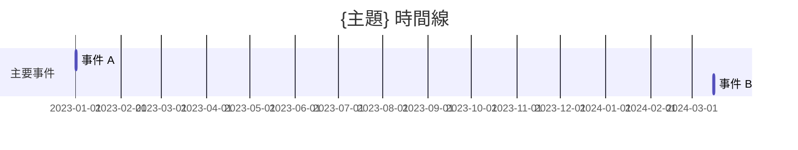

# Wiki Schema — Navi Helios 知識庫

## Domain

以「設計人生，釋放天賦，創造財富」為核心，涵蓋：
- 個人成長與自我認知（Mind / Spirit）
- 職業生涯與斜槓探索（Vocation）
- 生命平衡與身心健康（Body）
- AI 工具與自動化系統合構築
- 內容創作與個人品牌

## 為何需要 Wiki

傳統方式（RAG / 聊天記錄）每次問問題，AI 都要從頭閱讀原始文件，沒有積累。Wiki 的價值在於**知識被編譯一次，然後持續維護**，而不是每次重新推導。

> Wiki 是持續複合的構建物。Cross-references 已經在那裡。矛盾已經被標記。綜合已經反映所有攝入的內容。

## 三層架構對應

```
43_Sources/          ← Layer 1：原始來源（不可修改）
41_原子知識/          ← Layer 2：蒸餾後的磚塊
42_MOC/              ← Layer 3：查詢結果與知識地圖
purpose.md            ← 憲章：領域目標與核心問題
```

| LLM Wiki 標準 | 你的 vault |
|---|---|
| `raw/` | `43_Sources/` |
| `entities/` | `41_原子知識/K-*`（人物、組織）|
| `concepts/` | `41_原子知識/W-*`、`L-*`（主題、概念）|
| `comparisons/` | `41_原子知識/Comparisons/` |
| `queries/` | `42_MOC/`，包含 MOC index |
| `SCHEMA.md` | `40_Knowledge/SCHEMA.md`（本檔）|
| `purpose.md` | `40_Knowledge/purpose.md` |

## 命名規範

### 41_原子知識/

```
K-{DOMAIN}-{NNN}_{Title}.md    # K-SELF, K-CAREER
W-{CATEGORY}-{NNN}_{Title}.md  # W-智慧價值
L-{CATEGORY}-{NNN}_{Title}.md  # L-人生設計
Comparisons/                   # 比較頁子目錄
cmp-{title}.md                # 比較頁格式
```

- `NNN` = 三位數流水號
- `Title` 用英文/數字/連字符，避免中文檔名

### 42_MOC/

```
{Domain}-MOC.md                 # K-SELF_自我成長_MOC.md
index.md                        # MOC 總目錄
{Domain}-{NNN}_{Title}.md      # 其他 MOC 頁面
```

### 43_Sources/

```
SRC-{NNN}_{標題}.md            # SRC-001_Karpathy-LLM-Wiki.md
index.md                        # 來源總目錄
log.md                          # 操作日誌（逆序：最新在前）
```

## Frontmatter 規範

### 41_原子知識/ 的頁面

```yaml
---
title: Page Title
type: knowledge/atomic   # journal | project | content | rules | knowledge/atomic | knowledge/entity | knowledge/concept | knowledge/comparison | source | moc | query
status: seed           # seed | growing | mature | stale | wait | paused
tags: [self-growth, habit]
time_created: 2026-04-26
time_modified: 2026-04-26
parent: K-SELF_自我成長_MOC   # 隸屬 MOC（Wikilinks 在正文，不放 frontmatter）
related: []            # 平行相關知識點（Wikilinks 在正文，不放 frontmatter）
sources: []           # 來源：SRC-001, SRC-002
confidence: extracted # extracted | inferred | ambiguous | unverified
contradictions: []   # 衝突頁面列表
used_in: []          # 引用此頁的檔案（路徑，相對於 vault 根目錄）
---
```

**Confidence 顆粒度（sdyckjq-lab v3.3）：**

|| 等級 | 意義 | 原文佐證 |
||---|---|---|
|| `extracted` | 資訊直接出現在原文 | 需附原文摘錄（≤50 字） |
|| `inferred` | 資訊從多處推斷，原文未直接說 | 需附推理依據 |
|| `ambiguous` | 原文有歧義 | 可不附 |
|| `unverified` | 來自 AI 背景知識，原文無證據 | 可不附 |

**Wikilinks 位置聲明：** Obsidian 不支援 frontmatter 裡的 wikilinks。`related` 關係寫在正文末尾的 `## Related` section，不放 frontmatter。`parent` 放 MOC 名稱（字串），不放 Wikilinks。

### 42_MOC/ 的頁面

```yaml
---
title: MOC 名稱
type: moc             # moc | query
folder: 40_Knowledge
status: active
time_created: 2026-04-26
time_modified: 2026-04-26
parent: null
children: []          # 包含的原子頁面（Wikilinks 在正文）
related: []           # 相關 MOC
sources: []           # 綜合的來源
derived: true         # true = 衍生內容，非一手素材
confidence: inferred
---
```

### 43_Sources/ 的頁面

```yaml
---
title: 來源標題
type: source
source_url: https://...       # 原始 URL（若有）
source_type: article          # article | video | conversation | resource | gist
ingested: 2026-04-26
sha256: <hex digest>          # 內容 body 的 hash，用於偵測變更
raw_path: 43_Sources/SRC-001_xxx.md
---
```

`sha256` 用於偵測來源是否更新過。Re-ingest 時重新計算 body hash，與儲存值比對——相同則跳過，不同則標記 drift。

## Tag Taxonomy

所有標籤必須來自以下列表，新增前先加入這裡：

```
# 內容類型標籤
self-growth, career, wealth, life-design, content-creation
ai-tool, automation, productivity

# 素材類型標籤
atomic, entity, concept, comparison, moc, query, source

# 狀態標籤
seed, growing, mature, stale, wait, paused

# 特殊標籤
hypothesis, verified, contested, archived
```

## 意圖路由

根據用戶意圖進入對應工作流：

| 用戶意圖 | 工作流 |
|---|---|
| 初始化 / 新建 wiki | → **init** |
| 攝入 / ingest / 消化 / 把這篇加進 wiki | → **ingest** |
| 批量攝入 / 批量消化 | → **batch-ingest** |
| wiki 裡有沒有 / 查一下 / 問題 | → **query** |
| 深度分析 / 全面總結 / digest | → **digest** |
| 健康檢查 / lint / 孤立頁面 | → **lint** |
| 知識庫狀態 | → **status** |

意圖不明確時，直接問用戶。

## 更新政策

當新資訊與現有內容衝突：
1. 檢查日期——新來源通常覆寫舊的
2. 真正矛盾時，**停下來展示兩個版本**，不擅自裁決
3. 在 frontmatter 標記：`contradictions: [page-name]`
4. 在頁面正文加標記：`> ⚠️ 矛盾：此頁與 [[page-name]] 在 X 議題上立場衝突`

**矛盾比乾淨頁面更有價值。** 勇敢標記，不追求表面和諧。

## Ingest 工作流（sdyckjq-lab v3.3 完整版）

### 步驟 0：隱私自查（必要！不可跳過）

在開始分析任何來源前，**必須先說這段話並等待確認**：

> 在開始分析這份素材前，請先快速確認裡面**不包含**這些敏感內容：
> - 手機號碼（如 138xxxxxxxx）
> - 身份證號（18 位數字）
> - API 密鑰（`sk-...`、`AIzaSy...`、`OPENAI_API_KEY=`、`Bearer ...`）
> - 明文密碼（`password=`、`passwd=`）
> - 其他你不希望進入知識庫的個人資訊
>
> 如果有，請先刪除或脫敏後再繼續。確認請回 `y`，要中止請回 `n`。

**流程規則：**
- 回覆 `y`（或「可以」「繼續」「沒有」）→ 繼續執行
- 回覆 `n`（或「停」「取消」）→ 終止本次 ingest
- 其他回覆 → 再問一次，兩次都不是明確 y/n → 終止

> **繞過規則**：如果用戶在本次對話中已明確說過「素材沒有敏感訊息，直接開始」，可跳過此步。

### 步驟 1：內容長度分流

| 條件 | 模式 |
|---|---|
| 來源內容 > 1000 字 | **完整處理**（完整流程） |
| 來源內容 ≤ 1000 字 | **簡化處理**（跳過主題頁創建、overview 更新） |

### 步驟 2（完整處理）：預告 + 兩段式 LLM 處理

**2a. 預告（不要直接開始寫！）**

先告知用戶你發現了什麼：
- 核心實體、主要論點
- 哪些現有頁面會被更新，哪些需要新建
- 是否發現矛盾

用戶確認後再寫入檔案。

**2b. Step 1：結構化分析（輸出 JSON）**

輸入：原始內容 + `purpose.md` + 現有 wiki 結構
輸出：JSON 格式分析結果（不持久化，流程內傳遞）

```json
{
  "source_summary": "一句話概括",
  "entities": [{"name": "xxx", "type": "concept", "relevance": "high", "confidence": "EXTRACTED", "evidence": "原文摘錄或推理依據"}],
  "topics": [{"name": "xxx", "importance": "high"}],
  "connections": [{"from": "A", "to": "B", "type": "因果", "confidence": "INFERRED", "evidence": "推理依據"}],
  "contradictions": [{"claim_a": "...", "claim_b": "...", "context": "..."}],
  "new_vs_existing": {"new_entities": [], "updates": []}
}
```

**驗證**：JSON 寫入 `.wiki-tmp/step1-latest.json` → 呼叫 `validate-step1.sh` 驗證 → 刪除暫存檔。
驗證失敗 → 自動回退到單段處理，並在頁面頂部標註「本次處理因格式問題降級」。

**2c. Step 2：頁面生成**

輸入：原始內容 + `purpose.md` + Step 1 JSON + 相關現有頁面
輸出：所有需要創建/更新的 wiki 頁面內容

上下文載入規則：只讀取 `new_vs_existing.updates` 列出的已有頁面；若某頁 > 2000 字，只讀取 frontmatter + 需要更新的章節。

### 步驟 3（完整處理）：保存原始來源

到 `43_Sources/SRC-{NNN}_{title}.md`，加 frontmatter：
```yaml
source_url: https://...
source_type: article
ingested: 2026-04-26
sha256: <hex digest>   # 內容 body 的 hash，用於偵測變更
raw_path: 43_Sources/SRC-001_xxx.md
```

圖片檢測：掃描內容中的 `!\[` 或 ` ` | 緩存自癒成功 | 跳過 LLM 處理，直接複用 |
| `MISS:no_entry` | 首次處理此素材 | 正常處理 |
| `MISS:hash_changed` | 素材內容有變化 | 重新處理 |
| `MISS:no_source` | 有緩存但 source 頁被刪 | 重新處理 |
| `MISS:repaired_needs_verify` | 同名 source 但路徑不匹配 | 重新處理以確認關聯正確 |

## Query 工作流

1. 讀 `42_MOC/index.md` 定位相關 MOC
2. 搜尋相關 atomic 頁（別名展開：同義詞全部納入）
3. 綜合回答，引用 `[[頁面名]]`
4. 若答案來自 3+ 來源，詢問：「要把這個分析保存為 wiki 頁面嗎？好的洞見不該消失在對話歷史裡。」

## Digest 工作流（深度綜合，sdyckjq-lab v3.3）

**觸發關鍵詞：**
- 深度報告格式：`「給我講講 XX」「深度分析 XX」「综述 XX」「digest XX」「全面總結一下 XX」`
- 對比表格式：`「對比一下 X 和 Y」「比較 X 和 Y」「X 和 Y 有什麼區別」`
- 時間線格式：`「整理一下時間線」「按時間排列」「時間順序」`

不同於 query——digest 生成持久化報告，保存到 `wiki/synthesis/`。

### 三種輸出格式模板

**模板 A：深度報告（預設）**

```markdown
# {主題} 深度報告

> 綜合自 {N} 篇素材 | 生成日期：{日期}

## 背景概述
（简要说明这个主题的背景和重要性）

## 核心觀點
（按重要性排列，每個觀點標注來源）
- 觀點一（來源：[[素材A]]、[[素材B]]）
- 觀點二（來源：[[素材C]]）

## 不同視角對比
（如有多個素材觀點不同，在此對比）
| 維度 | 來源A的觀點 | 來源B的觀點 |
|---|---|---|
| ... | ... | ... |

## 知識脈絡
（按時間或邏輯順序梳理該主題的發展）

## 尚待解決的問題
（現有素材中尚未回答的問題，可作為下次搜集素材的方向）

## 相關頁面
（列出所有綜合來源的連結）
```

**模板 B：對比表（觸發詞：對比 / 比較）**

```markdown
# {對比主題} 對比分析

> 對比 {N} 個對象 | 生成日期：{日期}

## 對比對象
- [[對象 A]]
- [[對象 B]]

## 對比表
| 維度 | [[對象 A]] | [[對象 B]] |
|---|---|---|
| 核心觀點 | ... | ... |
| 適用場景 | ... | ... |
| 優點 | ... | ... |
| 缺點 / 限制 | ... | ... |
|來源素材 | [[素材1]] | [[素材2]] |

## 關鍵差異
（用 1-2 句話說清最重要的差異點）
```

**模板 C：時間線（觸發詞：時間線 / 按時間）**

```markdown
# {主題} 時間線

> 時間跨度：{起始年} ~ {結束年} | 生成日期：{日期}



> **注意事項：**
> - `gantt` 要求 `YYYY-MM-DD` 精度
> - 如果素材只有年份（如「2023 年」），補為該年第一天（`2023-01-01`）
> - 如果連年份都不確定，改用**純文字時間線**（無序列表按時間排序），不用 Mermaid gantt
> - 如果事件超過 15 個，建議按 section 分組

### Digest 流程

1. **別名展開搜索**：同 query 工作流，先讀取 `.wiki-schema.md` 中的「別詞表」展開同義詞（不跨組傳遞，自動去重）
2. **深度閱讀所有相關頁面**：單頁 > 3000 字 → 優先讀取 frontmatter + 核心觀點章節 + 與主題直接相關的段落，跳過「原文精彩摘錄」
3. **生成並保存報告**到 `wiki/synthesis/{主題}-深度報告.md`
4. **更新 index.md 和 log.md**

---

## Lint 檢查清單（sdyckjq-lab v3.3 完整版）

每週或每 10 個新來源後執行一次。

### Step 0：機械檢查（腳本執行）

```bash
bash ${SKILL_DIR}/scripts/lint-runner.sh
```

腳本負責三項機械檢查（不需要 AI 判斷）：
- **孤立頁面**：`entities/` 下沒有被其他頁面引用的實體
- **斷鏈**：`[[X]]` 連結指向的 `X.md` 不存在（支持 `[[X|別名]]` 語法）
- **Index 一致性**：`index.md` 有記錄但檔案缺失

退出碼：`0` = 完成，`1` = 腳本錯誤（路徑不存在、index.md 缺失）。

### Step 1：AI 判斷類檢查

- **矛盾信息**：閱讀相關頁面，檢查是否有互相矛盾的說法 → 列出發現的矛盾，標注來源頁面
- **交叉引用缺失**：檢查相關主題頁面之間是否應該互相連結但沒鏈
- **置信度報告**：統計 `EXTRACTED` / `INFERRED` / `AMBIGUOUS` / `UNVERIFIED` 分佈
  - 高亮 `AMBIGUOUS` 條目，提醒用戶優先驗證
  - 抽查標注為 `EXTRACTED` 的條目，檢查是否能在原始素材裡找到對應原文
- **補充建議**：基於 Step 0 腳本的孤立頁/斷鏈輸出，給出修復建議

### 檢查範圍

- 最近更新的 10 個頁面（按修改時間）
- 隨機抽查 10 個頁面
- 如果頁面總數 ≤ 20，檢查全部

---

## Status 工作流

查看知識庫狀態。步驟：

1. 統計 `raw/` 各目錄的檔案數（按來源總表）
2. 統計 `wiki/entities/`、`wiki/topics/`、`wiki/sources/`、`wiki/comparisons/`、`wiki/synthesis/` 的頁面數
3. 讀取 `log.md` 最後 5 條記錄
4. 讀取 `index.md` 獲取主題概覽
5. **輸出**：素材分佈 + Wiki 頁面數 + 最近活動 + 建議

---

## Graph 工作流（知識圖譜）

觸發：`「畫個知識圖譜」「看看關聯圖」「graph」「知識庫地圖」`

### 步驟

1. **掃描雙向連結**：遍歷 `wiki/` 下所有 `.md` 檔，提取 `[[連結]]` 語法，建立關係列表
2. **生成 Mermaid 圖表檔** `wiki/knowledge-graph.md`：
   - 節點名太長 → 截斷到 10 字
   - 只展示有雙向連結關係的節點（孤立節點不納入圖譜）
   - 關係超過 50 條 → 只保留被引用次數最多的 30 個節點
   - **預設全部使用無標註箭頭 `A --> B`**，不打標關係類型
3. **生成交互式 HTML**：`wiki/knowledge-graph.html`（可選，需 `jq` + `node`）

> **手動美化**（生成後由用戶自己做）：參考 `.wiki-schema.md` 裡的「關係類型詞彙表」（實現 / 依賴 / 對比 / 矛盾 / 衍生），把最重要的 3-5 條箭頭改寫為 `A -->|實現| B` 之類的帶標註寫法。

---

## 頁面閾值（Page Thresholds）

## 內容原則

### 必須保留
- 所有數字、百分比、時間盒數值
- 具體案例的完整故事線
- 教練實踐中的對話片段
- 貢獻者的原始表達方式

### 絕對禁止
- 修改 `43_Sources/` 中的任何檔案（raw 是 immutable）
- 未標註來源地合併不同來源的說法
- 刪除數字或案例細節
- 靜默覆蓋矛盾

## 憲章附屬檔案

### purpose.md（領域北極星）

定義這個 wiki 的核心目標和關鍵問題。所有 ingest 都應該優先參考這個方向。

路徑：`40_Knowledge/purpose.md`

內容格式：
```markdown
# Purpose — Navi Helios 知識庫

## 核心目標
（你的終極目的是什麼？）

## 關鍵問題
- 問題 1
- 問題 2

## 研究範圍
（哪些內容屬於這個 wiki，哪些不屬於？）

## 界線
（什麼情況下果斷不攝入？）
```

## Page Thresholds

| 情況 | 動作 |
|---|---|
| 出現 2+ 來源中 | 建立 entity/concept 頁 |
| 某概念是單一來源核心 | 建立 atomic 頁 |
| 引用 < 2 次的提及 | **不建立**獨立頁面，寫入相關頁面 |
| 頁面 > 200 行 | 拆分為子頁面，用 [[wikilinks]] 連結 |
| 內容被完全取代 | 移到 `_archive/`，從 index 移除 |

## 縮放規則

- `42_MOC/index.md` 任何分類 > 50 條 → 按子領域拆分
- `log.md` > 500 條 → 輪轉：重新命名為 `log-2026.md`，新建空 log

## 陷阱

- **千萬不要修改 raw/ 任何檔案**
- **每次 session 開始先讀 SCHEMA + log 方向**
- **永遠更新 index.md 和 log.md**
- **不要建立沒有交叉引用的頁面**（孤立頁是隱形頁）
- **每個 atomic 頁至少 2 個 outbound [[wikilinks]]**
- **遇到矛盾停下來展示，不擅自裁決**
