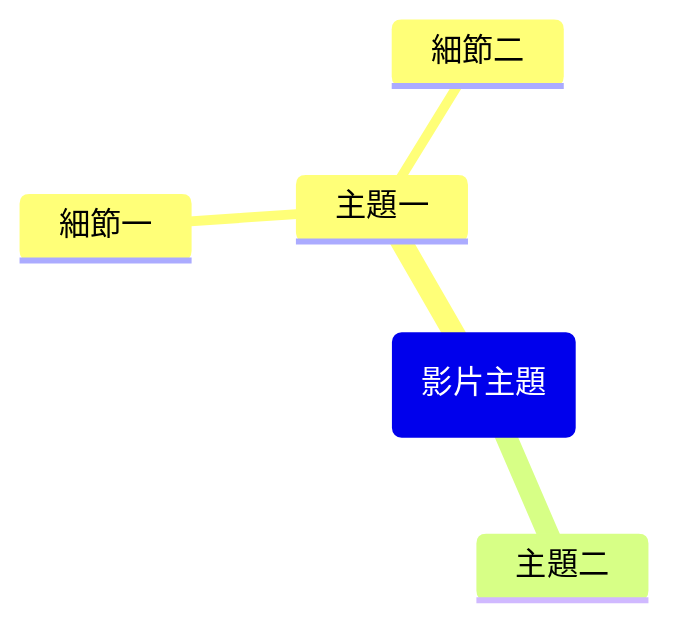

# 提示詞：YouTube 逐字稿擷取

基於提供的 YouTube 影片資訊與逐字稿，生成完整的 Obsidian 筆記。

## 指令規則

> [!IMPORTANT] 
> 如果找不到影片上下文，請提示使用者：
> 1. 開啟 YouTube 影片
> 2. 使用 @ 符號選取 YouTube 分頁
> 3. 再次執行此指令

### 筆記結構需求：

---
title: "<影片標題>"
description: "< 200 字的描述>"
channel: "<頻道名稱>"
url: "<影片連結>"
duration: "<片長>"
published: <YYYY-MM-DD 格式的上傳日期>
thumbnailUrl: "i.ytimg.com/vi/VIDEO_ID/maxresdefault.jpg"
genre:
  - "<類型>"
watched:
---

> [!summary]- 原始完整描述
> <完整影片描述，保留換行>

## 內容摘要 (Summary)

<針對影片內容進行 2-3 段的簡短摘要>

## 核心要點 (Key Takeaways)

<以清單形式列出 5-8 個核心觀點>

## 心智圖 (Mindmap)

**必須嚴格遵守 Mermaid mindmap 語法：**
- 根節點格式：`root(主題名稱)` - 使用圓括號，禁止雙方括號
- 子節點：純文字，禁止括號、引號、圖示或 Emoji
- 節點文字極簡化：建議每個節點 3-4 字

## 精選金句與時間戳 (Notable Quotes)

<從逐字稿中列出 5-10 個精選金句，格式如下：>
- [<時間戳>: <金句內容>](<影片連結>&t=<秒數>s)

---
**僅回傳 Markdown 內容，不要包含任何解釋。**
