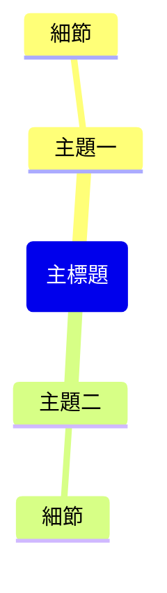

# 提示詞：網頁擷取

基於提供的網頁內容（來自 Obsidian Web Clipper 或瀏覽器上下文），生成完整的 Obsidian 筆記。

## 指令規則

> [!IMPORTANT] 
> 如果找不到網頁上下文，請提示使用者：
> 1. 在瀏覽器中開啟網頁
> 2. 使用 @ 符號選取網頁分頁
> 3. 再次執行此指令

### 筆記結構需求：

---
title: "<網頁標題>"
source: "<網頁 URL>"
description: "<簡短描述>"
tags:
  - "clippings"
---

## 內容摘要 (Summary)

<針對網頁內容進行 2-3 段的簡短摘要>

## 核心要點 (Key Takeaways)

<以清單形式列出 5-8 個核心觀點>

## 心智圖 (Mindmap)

**必須嚴格遵守 Mermaid mindmap 語法：**
- 根節點格式：`root(主題名稱)` - 使用圓括號，禁止使用雙方括號 `[[]]`
- 子節點：直接輸入純文字，無需任何括號
- **禁止**在文字中使用引號、括號或任何特殊符號
- 節點文字必須簡短：建議每個節點不超過 4 個字

## 精選金句 (Notable Quotes)

<列出內容中的 3-5 個精選句子，若有>

---
**僅回傳 Markdown 內容，不要包含任何額外的解釋或評論。**
