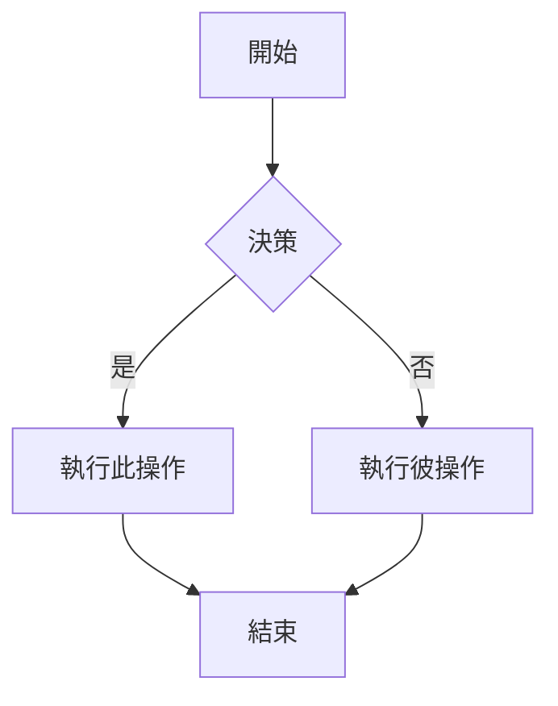

# Obsidian 格式 Markdown 技能

此技能使具備技能相容性的代理人能夠建立和編輯有效的 Obsidian 格式 Markdown，包括所有 Obsidian 特有的語法擴充。

## 概覽

Obsidian 使用多種 Markdown 語法的組合：
- [CommonMark](https://commonmark.org/)
- [GitHub Flavored Markdown (GFM)](https://github.github.com/gfm/)
- [LaTeX](https://www.latex-project.org/) 用於數學公式
- Obsidian 特有擴充（雙向連結、引註、嵌入等）

## 基本格式

### 段落與換行

```markdown
這是一個段落。

這是另一個段落（中間的空行會建立獨立的段落）。

若要在段落內換行，請在行尾添加兩個空白鍵，
或使用 Shift+Enter。
```

### 標題

```markdown
# 標題 1
## 標題 2
### 標題 3
#### 標題 4
##### 標題 5
###### 標題 6
```

### 文字格式

| 樣式 | 語法 | 範例 | 輸出 |
|-------|--------|---------|--------|
| 粗體 | `**文字**` or `__text__` | `**粗體**` | **粗體** |
| 斜體 | `*文字*` or `_text_` | `*斜體*` | *斜體* |
| 粗斜體 | `***文字***` | `***兩者皆有***` | ***兩者皆有*** |
| 刪除線 | `~~文字~~` | `~~刪除線~~` | ~~刪除線~~ |
| 高亮 | `==文字==` | `==高亮顯示==` | ==高亮顯示== |
| 行內代碼 | `` `代碼` `` | `` `代碼` `` | `代碼` |

### 轉義格式

使用反斜線來轉義特殊字元：
```markdown
\*這不會變成斜體\*
\#這不會變成標題
1\. 這不會變成列表項目
```

常需轉義的字元：`\*`, `\_`, `\#`, `` \` ``, `\|`, `\~`

## 內部連結 (Wikilinks)

### 基本連結

```markdown
[[筆記名稱]]
[[筆記名稱.md]]
[[筆記名稱|顯示文字]]
```

### 連結到標題

```markdown
[[筆記名稱#標題名稱]]
[[筆記名稱#標題名稱|自定義文字]]
[[#當前筆記中的標題]]
[[##搜尋資源庫中所有標題]]
```

### 連結到區塊

```markdown
[[筆記名稱#^區塊ID]]
[[筆記名稱#^區塊ID|自定義文字]]
```

透過在段落末尾添加 `^區塊ID` 來定義區塊 ID：
```markdown
這是一個可以被連結的段落。 ^我的區塊ID
```

對於列表和引用，請將區塊 ID 放在單獨的一行：
```markdown
> 這是一段引用
> 包含多行內容

^引用ID
```

### 搜尋連結

```markdown
[[##heading]]     搜尋包含 "heading" 的標題
[[^^block]]       搜尋包含 "block" 的區塊
```

## Markdown 風格連結

```markdown
[顯示文字](筆記名稱.md)
[顯示文字](筆記名稱.md#標題名稱)
[顯示文字](https://example.com)
[筆記](obsidian://open?vault=VaultName&file=Note.md)
```

注意：Markdown 連結中的空格必須經 URL 編碼為 `%20`。

## 嵌入 (Embeds)

### 嵌入筆記

```markdown
![[筆記名稱]]
![[筆記名稱#標題名稱]]
![[筆記名稱#^區塊ID]]
```

### 嵌入圖片

```markdown
![[圖片.png]]
![[圖片.png|640x480]]    寬度 x 高度
![[圖片.png|300]]        僅指定寬度（保持寬高比）
```

### 外部圖片

```markdown


```

### 嵌入音訊

```markdown
![[音訊.mp3]]
![[音訊.ogg]]
```

### 嵌入 PDF

```markdown
![[文件.pdf]]
![[文件.pdf#page=3]]
![[文件.pdf#height=400]]
```

### 嵌入列表

```markdown
![[筆記#^列表ID]]
```

其中列表已定義區塊 ID：
```markdown
- 項目 1
- 項目 2
- 項目 3

^列表ID
```

### 嵌入搜尋結果

````markdown
```query
tag:#project status:done
```
````

## 引註 (Callouts)

### 基本引註

```markdown
> [!note]
> 這是一個筆記 (Note) 引註。

> [!info] 自定義標題
> 此引註具有自定義標題。

> [!tip] 僅顯示標題
```

### 折疊式引註

```markdown
> [!faq]- 預設折疊
> 此內容在展開前是隱藏的。

> [!faq]+ 預設展開
> 此內容可見但可以被折疊。
```

### 嵌套引註

```markdown
> [!question] 外層引註
> > [!note] 內層引註
> > 嵌套內容
```

### 支援的引註類型

| 類型 | 別名 | 描述 |
|------|---------|-------------|
| `note` | - | 藍色，鉛筆圖示 |
| `abstract` | `summary`, `tldr` | 青色，剪貼簿圖示 |
| `info` | - | 藍色，資訊圖示 |
| `todo` | - | 藍色，勾選框圖示 |
| `tip` | `hint`, `important` | 青色，火焰圖示 |
| `success` | `check`, `done` | 綠色，打勾圖示 |
| `question` | `help`, `faq` | 黃色，問號圖示 |
| `warning` | `caution`, `attention` | 橘色，警告圖示 |
| `failure` | `fail`, `missing` | 紅色，X 圖示 |
| `danger` | `error` | 紅色，閃電圖示 |
| `bug` | - | 紅色，蟲子圖示 |
| `example` | - | 紫色，清單圖示 |
| `quote` | `cite` | 灰色，引號圖示 |

## 列表

### 無序列表

```markdown
- 項目 1
- 項目 2
  - 嵌套項目
  - 另一個嵌套
- 項目 3

* 也可以使用星號
+ 或加號
```

### 有序列表

```markdown
1. 第一項
2. 第二項
   1. 嵌套編號項
   2. 另一個嵌套
3. 第三項

1) 替代語法
2) 使用右括號
```

### 任務列表

```markdown
- [ ] 未完成任務
- [x] 已完成任務
- [ ] 帶有子任務的任務
  - [ ] 子任務 1
  - [x] 子任務 2
```

## 引用 (Quotes)

```markdown
> 這是一段塊狀引用 (Blockquote)。
> 它可以跨越多行。
>
> 並且包含多個段落。
>
> > 嵌套引用也能正常運作。
```

## 代碼

### 行內代碼

```markdown
使用 `反引號` 表示行內代碼。
使用雙反引號表示 ``包含 ` 反引號的代碼``。
```

### 代碼塊

````markdown
```
普通代碼塊
```

```javascript
// 語法高亮的代碼塊
function hello() {
  console.log("Hello, world!");
}
```

```python
# Python 範例
def greet(name):
    print(f"Hello, {name}!")
```
````

## 表格

```markdown
| 標題 1 | 標題 2 | 標題 3 |
|---|---|---|
| 單元格 1 | 單元格 2 | 單元格 3 |
| 單元格 4 | 單元格 5 | 單元格 6 |
```

### 對齊方式

```markdown
| 左對齊     | 置中對齊   | 右對齊    |
|:---|:---:|---:|
| 左     | 中   | 右    |
```

## 數學公式 (LaTeX)

### 行內公式

```markdown
這是行內公式：$e^{i\pi} + 1 = 0$
```

### 塊狀公式

```markdown
$$
\begin{vmatrix}
a & b \\
c & d
\end{vmatrix} = ad - bc
$$
```

## 圖表 (Mermaid)

````markdown

````

## 屬性 (Frontmatter)

屬性使用筆記開頭的 YAML 區塊：

```yaml
---
title: 我的筆記標題
date: 2024-01-15
tags:
  - project
  - important
aliases:
  - 我的筆記
  - 替代名稱
cssclasses:
  - custom-class
status: in-progress
rating: 4.5
completed: false
due: 2024-02-01T14:30:00
related:
  - "[[連結筆記名稱]]"
---
```

## 標籤

```markdown
#標籤
#嵌套/標籤
#帶連字號的標籤
#帶底線的標籤
```

## 參考文獻

- [基本格式語法](https://help.obsidian.md/syntax)
- [高級格式語法](https://help.obsidian.md/advanced-syntax)
- [Obsidian 格式 Markdown](https://help.obsidian.md/obsidian-flavored-markdown)
- [內部連結](https://help.obsidian.md/links)
- [嵌入檔案](https://help.obsidian.md/embeds)
- [引註](https://help.obsidian.md/callouts)
- [屬性](https://help.obsidian.md/properties)
